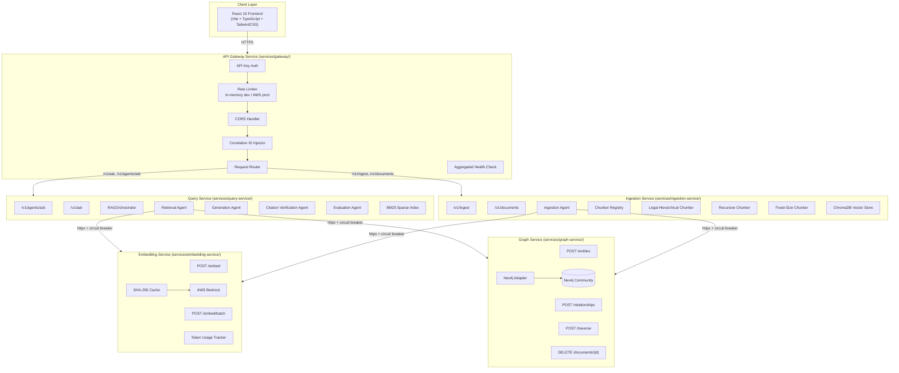
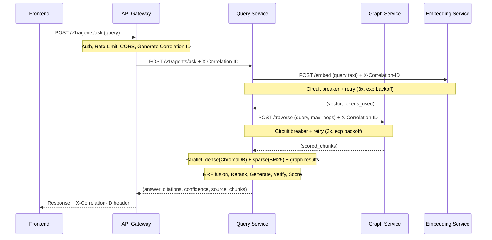
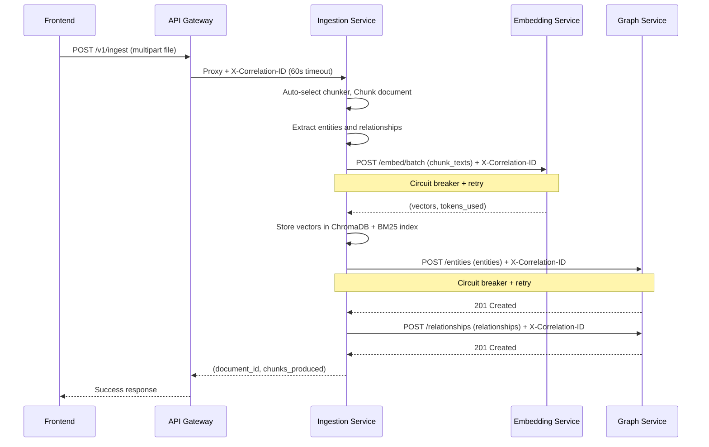
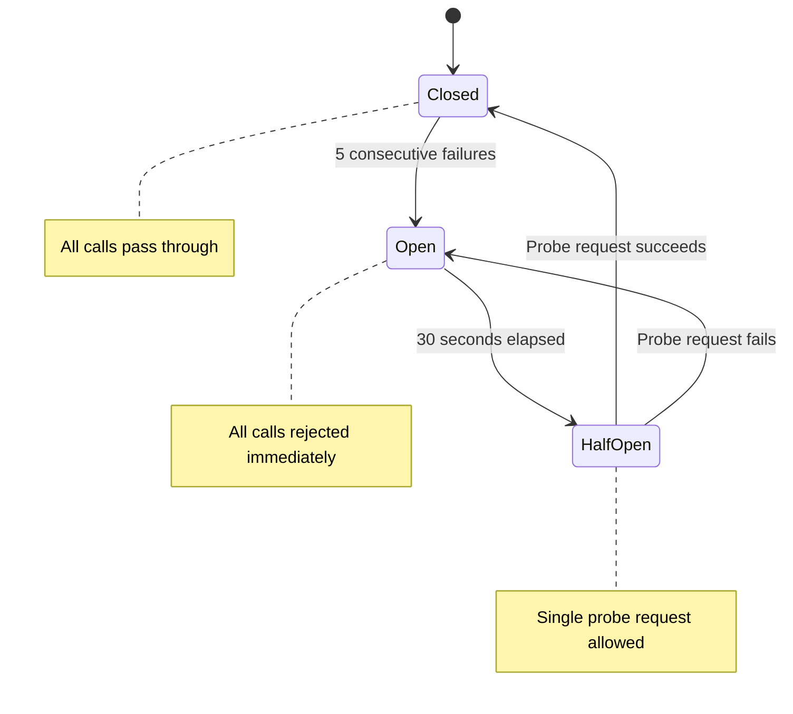

# Design Document: Legislation RAG Platform (Microservices Architecture)

## Overview

The Legislation RAG Platform is a microservices-based system enabling internal users to query legislation, policies, and business rules through a natural language chat interface. The platform employs hybrid retrieval (dense vector, sparse BM25, and knowledge graph traversal) combined with Reciprocal Rank Fusion, Strands Agents for orchestration, and a React 19 frontend.

The architecture comprises **five FastAPI microservices** and a **React SPA frontend**, communicating via HTTP with resilience patterns (circuit breaker, retry with exponential backoff). Each service owns its data store exclusively — no shared databases.

### Key Design Decisions

1. **FastAPI Gateway in dev, AWS API Gateway in prod** — Same behavior (auth, rate limiting, routing, CORS, correlation ID), different implementation. The FastAPI gateway replicates AWS API Gateway features locally using in-memory token bucket for rate limiting.
2. **Each service owns its data store exclusively** — Graph_Service owns Neo4j, Embedding_Service owns Bedrock access, Ingestion_Service owns ChromaDB and BM25 index, Query_Service owns no persistent storage.
3. **Graceful degradation when non-critical services are unavailable** — When Graph_Service or Embedding_Service circuits are open, Query_Service returns degraded results using remaining methods with renormalized weights.
4. **DDD patterns** — Domain events for the ingestion pipeline, value objects for IDs (DocumentId, ChunkId, EntityId), aggregate roots for documents. Shared domain models in `libs/domain-models/`.
5. **Shared domain-models library** — A single Pydantic model package (`libs/domain-models/`) installed editable in all services prevents model duplication and schema drift.
6. **Circuit breaker + retry at inter-service boundaries** — Prevents cascade failures. 5 consecutive failures open for 30s, then half-open probe. Retries: 3 attempts, exponential backoff (1s base), jitter up to 500ms.
7. **Shared httpx client library** — `libs/service-client/` encapsulates connection pooling, circuit breaker, retry, and correlation ID propagation for all inter-service calls.
8. **OpenTelemetry distributed tracing** — All services export spans via OTLP with X-Correlation-ID as trace parent, enabling end-to-end latency visualization.

## Architecture

### Repository Structure

```
services/
  gateway/               # FastAPI API Gateway service
    src/
    tests/
    Dockerfile
    pyproject.toml
  query-service/         # FastAPI query orchestration
    src/
    tests/
    Dockerfile
    pyproject.toml
  ingestion-service/     # FastAPI document processing
    src/
    tests/
    Dockerfile
    pyproject.toml
  graph-service/         # FastAPI Neo4j wrapper
    src/
    tests/
    Dockerfile
    pyproject.toml
  embedding-service/     # FastAPI Bedrock embedding wrapper
    src/
    tests/
    Dockerfile
    pyproject.toml
libs/
  domain-models/         # Shared Pydantic models (pip install -e)
    src/
    pyproject.toml
  service-client/        # Shared httpx + circuit breaker + retry
    src/
    pyproject.toml
frontend/                # React 19 SPA (Vite + TypeScript + TailwindCSS)
  src/
  package.json
infrastructure/
  terraform/             # AWS IaC (VPC, ECS/Fargate, ALB, etc.)
  docker/                # Dockerfiles and docker-compose.yml
data/
  sample_documents/      # 8 synthetic legislative documents
  golden_dataset.json    # 20 golden Q&A pairs
tests/
  e2e/                   # Cross-service E2E tests
  contract/              # API contract tests between services
```

### System Architecture Diagram



### Inter-Service Communication Flow



### Ingestion Pipeline Flow (Cross-Service)



### Circuit Breaker State Machine



## Components and Interfaces

### 1. API Gateway Service (`services/gateway/`)

Centralized entry point handling cross-cutting concerns. Replicates AWS API Gateway behavior in the dev environment.

**Middleware stack (applied in order):**
1. CORS middleware
2. Correlation ID middleware (generate UUID v4, inject X-Correlation-ID)
3. API Key authentication middleware
4. Rate limiting middleware (in-memory token bucket, 60 req/min/key)
5. Request/response logging middleware (structlog JSON)
6. Proxy routing middleware

**Endpoints:**
| Path Pattern | Target Service | Timeout |
|---|---|---|
| `/v1/ask`, `/v1/agents/ask` | Query Service | 30s |
| `/v1/ingest`, `/v1/documents` | Ingestion Service | 60s |
| `/health` | Aggregated health | 5s per downstream |

**Rate Limiting:**
- Dev: In-memory token bucket (60 requests/minute/API key)
- Prod: AWS API Gateway throttling configuration

**Authentication:**
- Validate X-API-Key header against configured key set
- Return HTTP 401 if missing or invalid
- Log key identifier (not full value) in structured logs

**CORS Configuration (dev):**
- Origins: `http://localhost:3000`, `http://localhost:5173`
- Methods: GET, POST, DELETE
- Headers: Content-Type, X-API-Key, X-Correlation-ID

**CSP Headers:**
- Content-Security-Policy restricting script-src to 'self' and required inline scripts

### 2. Query Service (`services/query-service/`)

Hosts the RAGOrchestrator and coordinates the agent pipeline. Makes inter-service HTTP calls to Graph Service and Embedding Service.

**Key classes:**

```python
class RAGOrchestrator:
    """Coordinates agents for query processing."""

    def __init__(
        self,
        retrieval_agent: RetrievalAgent,
        generation_agent: GenerationAgent,
        citation_agent: CitationVerificationAgent,
        evaluation_agent: EvaluationAgent,
        graph_client: GraphServiceClient,
        embedding_client: EmbeddingServiceClient,
    ) -> None: ...

    async def ask(self, query: str, correlation_id: str) -> AskResult: ...
```

**Endpoints:**
- `POST /v1/agents/ask` — Full agent-orchestrated pipeline
- `POST /v1/ask` — Direct retrieval-only queries (existing)
- `GET /health`, `GET /health/ready`, `GET /health/live`
- `GET /metrics` — Prometheus metrics

**Agent Pipeline Sequence:**
1. Retrieval Agent: parallel dense (via Embedding Service) + sparse (local BM25) + graph (via Graph Service)
2. RRF fusion (k=60, weights: dense=0.5, sparse=0.2, graph=0.3)
3. Cross-encoder reranking: top 5
4. Generation Agent: answer with citations
5. Citation Verification Agent: verify citations against sources
6. Evaluation Agent: confidence scores + fallback decision

### 3. Ingestion Service (`services/ingestion-service/`)

Handles document upload, chunking, embedding (via Embedding Service), and graph storage (via Graph Service). Owns ChromaDB and BM25 index.

**Endpoints:**
- `POST /v1/ingest` — Document upload (multipart)
- `GET /v1/documents` — List ingested documents
- `GET /health`, `GET /health/ready`, `GET /health/live`
- `GET /metrics`

**Ingestion Pipeline:**
1. Receive file: validate format/size
2. Auto-select chunker via Chunker Registry
3. Chunk document (preserving hierarchy for legal docs)
4. Extract entities and relationships (Ingestion Agent)
5. Call Embedding Service `/embed/batch` for chunk vectors
6. Store vectors in ChromaDB + tokens in BM25
7. Call Graph Service `POST /entities` + `POST /relationships`
8. Return `{document_id, chunks_produced}`

### 4. Graph Service (`services/graph-service/`)

Exclusive owner of Neo4j. Exposes entity/relationship CRUD and traversal via REST API.

**Key classes:**

```python
class Neo4jGraphStore:
    """Neo4j adapter implementing GraphStorePort."""

    def __init__(self, driver: AsyncDriver, database: str = "neo4j") -> None: ...
    async def initialize(self) -> None: ...
    async def store_entities(self, entities: list[ExtractedEntity]) -> None: ...
    async def store_relationships(self, relationships: list[ExtractedRelationship]) -> None: ...
    async def traverse(self, query: str, max_hops: int = 2) -> list[ScoredChunk]: ...
    async def delete_by_document(self, document_id: str) -> None: ...
    async def close(self) -> None: ...
```

**Endpoints:**
| Endpoint | Method | Description |
|---|---|---|
| `/entities` | POST | Batch store entities (MERGE by id) |
| `/relationships` | POST | Batch store relationships |
| `/traverse` | POST | Execute graph traversal query |
| `/documents/{document_id}` | DELETE | Delete all entities/relationships for document |
| `/health` | GET | Neo4j connectivity check |
| `/health/ready` | GET | Pool established + indexes exist |
| `/health/live` | GET | Process running (always 200) |
| `/metrics` | GET | Prometheus metrics |

**Neo4j Configuration:**
- Async driver with connection pool: 10-50 connections
- Per-query timeout: 5 seconds
- MERGE by entity `id` for idempotent upserts
- Indexes on `entity_type` and `source_chunk_id`
- Score formula: `1.0 / (1 + hop_distance)`
- Max hops capped at 5

### 5. Embedding Service (`services/embedding-service/`)

Exclusive owner of AWS Bedrock embedding API. Provides caching to avoid redundant calls and tracks token usage for cost attribution.

**Endpoints:**
| Endpoint | Method | Description |
|---|---|---|
| `/embed` | POST | Single text to vector (with cache check) |
| `/embed/batch` | POST | List of texts to list of vectors (per-item cache) |
| `/health` | GET | Bedrock connectivity check |
| `/health/ready` | GET | Cache initialized + credentials valid |
| `/health/live` | GET | Process running (always 200) |
| `/metrics` | GET | Prometheus metrics |

**Caching Strategy:**
- SHA-256 hash of input text as cache key
- Cache hit: return immediately (no Bedrock call)
- Cache miss: call Bedrock, cache result, return
- Batch: check each item individually, batch only uncached to Bedrock
- Return `tokens_used` in every response for cost tracking

### 6. React Frontend (`frontend/`)

Single-page application providing chat and document management.

**Component Tree:**
```
App
├── ChatView
│   ├── ConversationHistory
│   │   └── MessageBubble (answer + citation markers)
│   ├── SourcePanel
│   │   └── SourceChunkCard (section, score, method)
│   ├── ConfidenceIndicator (green/amber/red)
│   └── ChatInput (text field + send button)
├── DocumentView
│   ├── UploadArea (drag-and-drop + file picker)
│   └── DocumentList (filename, format, date)
└── Layout (navigation between Chat and Documents)
```

**API Integration (all requests go through API Gateway):**
- `POST /v1/agents/ask` — chat queries
- `POST /v1/ingest` — document upload (multipart)
- `GET /v1/documents` — document list
- Base URL: `VITE_API_BASE_URL` (default: `http://localhost:8080`)
- X-API-Key header included on all requests

### 7. Shared Libraries

#### `libs/domain-models/`

Pydantic models shared across all services:
- `ExtractedEntity`, `ExtractedRelationship`, `ScoredChunk`
- `QueryRequest`, `QueryResponse`
- `IngestionRequest`, `IngestionResponse`
- `EmbedRequest`, `EmbedResponse`, `EmbedBatchRequest`, `EmbedBatchResponse`
- `TraverseRequest`, `TraverseResponse`
- `HealthResponse`, `ErrorResponse`
- Enums: `ChunkingStrategy`, `LegalEntityType`, `LegalRelationshipType`

#### `libs/service-client/`

Shared HTTP client with resilience patterns:

```python
class ResilientClient:
    """httpx AsyncClient with circuit breaker, retry, and correlation ID propagation."""

    def __init__(
        self,
        base_url: str,
        circuit_breaker: CircuitBreaker,
        max_connections: int = 100,
        max_keepalive_connections: int = 20,
    ) -> None: ...

    async def request(
        self,
        method: str,
        path: str,
        correlation_id: str,
        **kwargs,
    ) -> httpx.Response: ...


class CircuitBreaker:
    """Circuit breaker with configurable thresholds."""

    def __init__(
        self,
        failure_threshold: int = 5,
        reset_timeout: float = 30.0,
        half_open_max_calls: int = 1,
    ) -> None: ...

    @property
    def state(self) -> CircuitState: ...
    def record_success(self) -> None: ...
    def record_failure(self) -> None: ...
    def allow_request(self) -> bool: ...


class RetryPolicy:
    """Exponential backoff retry with jitter."""

    def __init__(
        self,
        max_attempts: int = 3,
        base_delay: float = 1.0,
        multiplier: float = 2.0,
        max_jitter: float = 0.5,
    ) -> None: ...

    async def execute(self, func: Callable) -> Any: ...
```

### 8. Legal-Hierarchical Chunker

Located in `services/ingestion-service/src/domain/processing/`.

```python
class LegalHierarchicalChunker:
    """Chunker preserving legislative hierarchy context."""

    def __init__(self, max_chunk_size: int = 1000, min_body_chars: int = 100) -> None: ...
    def chunk(self, document: NormalizedDocument) -> list[Chunk]: ...
    def _extract_hierarchy(self, sections: list[Section], offset: int) -> str: ...
    def _build_prefix(self, act_title: str, part_heading: str) -> str: ...
```

**Hierarchy detection patterns:**
- Act title: first H1 or line matching `<Title> Act <Year>`
- Part heading: `Part \d+` or `Division \d+`
- Section: `Section \d+` or `\d+\.` at line start

**Chunk metadata additions:**
- `hierarchy_path`: e.g., "Part 3, Division 2, Section 45"
- `parent_document_title`: Act/Regulation title or filename fallback
- `section_heading`: always non-empty

### 9. Chunker Registry

```python
class ChunkerRegistry:
    """Registry with auto-selection based on document format."""

    def __init__(self, factory: ChunkerFactory) -> None: ...
    def auto_select(self, filename: str, metadata: dict) -> Chunker: ...
    @property
    def registered_strategies(self) -> list[dict[str, Any]]: ...
```

**Auto-selection rules:**
| Extension | Condition | Strategy |
|---|---|---|
| `.pdf`, `.md` | Contains "Act", "Regulation", "Rule", "Policy" | `legal_hierarchical` |
| `.pdf`, `.md` | No legislative keyword | `recursive` |
| `.html` | Any | `recursive` |
| `.txt` | Any | `fixed_size` |
| Other | Any | `fixed_size` |

### 10. Hybrid Search with RRF Fusion

Within the Query Service's Retrieval Agent:
- Execute dense, sparse, and graph search in parallel (5s timeout each)
- Dense search: query Embedding Service for vector, then search ChromaDB
- Sparse search: local BM25 index
- Graph search: call Graph Service `/traverse`
- Retrieve top 20 from each method
- Fuse with RRF (k=60, weights: dense=0.5, sparse=0.2, graph=0.3)
- Renormalize weights when methods are unavailable
- Rerank top 20 fused results, return top 5

### 11. Confidence Scoring and Fallback

**Formula:** `composite = 0.35 * retrieval_confidence + 0.40 * citation_coverage + 0.25 * answer_completeness`

**Sub-scores:**
- `retrieval_confidence`: max reranked score normalized to [0.0, 1.0]
- `citation_coverage`: verified_citations / total_factual_statements
- `answer_completeness`: addressed_concepts / total_query_concepts

**Fallback trigger:** composite < 0.4 triggers `FallbackResponse` with found/not-found topics and suggested documents.

## Data Models

### Shared Domain Models (`libs/domain-models/`)

```python
# --- Enums ---
class ChunkingStrategy(str, Enum):
    FIXED_SIZE = "fixed_size"
    RECURSIVE = "recursive"
    SEMANTIC = "semantic"
    LEGAL_HIERARCHICAL = "legal_hierarchical"

class LegalEntityType(str, Enum):
    ACT = "Act"
    SECTION = "Section"
    REGULATION = "Regulation"
    DEFINITION = "Definition"
    OBLIGATION = "Obligation"
    AUTHORITY = "Authority"
    PENALTY = "Penalty"

class LegalRelationshipType(str, Enum):
    CONTAINS = "CONTAINS"
    DEFINES = "DEFINES"
    AMENDS = "AMENDS"
    REFERENCES = "REFERENCES"
    IMPLEMENTS = "IMPLEMENTS"
    IMPOSES = "IMPOSES"
    GRANTS_POWER = "GRANTS_POWER"
    PRESCRIBES_PENALTY = "PRESCRIBES_PENALTY"

class CircuitState(str, Enum):
    CLOSED = "closed"
    OPEN = "open"
    HALF_OPEN = "half_open"

# --- Core Domain Models ---
class ExtractedEntity(BaseModel):
    id: str
    name: str
    entity_type: LegalEntityType
    description: str
    source_chunk_id: str
    properties: dict[str, Any] = {}

class ExtractedRelationship(BaseModel):
    id: str
    source_entity_id: str
    target_entity_id: str
    relationship_type: LegalRelationshipType
    description: str
    properties: dict[str, Any] = {}

class ScoredChunk(BaseModel):
    chunk_id: str
    document_id: str
    text: str
    section_heading: str
    score: float
    retrieval_method: str
    metadata: dict[str, Any] = {}

# --- API Request/Response Models ---
class AgentAskRequest(BaseModel):
    query: str = Field(..., min_length=1, max_length=2000)

class CitationResponse(BaseModel):
    index: int
    source_reference: str
    claim: str
    verification_status: str

class ConfidenceScoreResponse(BaseModel):
    retrieval_confidence: float
    citation_coverage: float
    answer_completeness: float
    composite: float

class SourceChunkResponse(BaseModel):
    chunk_id: str
    document_id: str
    text: str
    section_heading: str
    score: float
    retrieval_method: str

class FallbackInfoResponse(BaseModel):
    found_topics: list[str]
    not_found_topics: list[str]
    suggested_documents: list[str]

class AgentAskResponse(BaseModel):
    answer: str
    citations: list[CitationResponse]
    confidence_scores: ConfidenceScoreResponse
    source_chunks: list[SourceChunkResponse]
    is_fallback: bool
    fallback_info: FallbackInfoResponse | None = None

class ErrorResponse(BaseModel):
    error_code: str
    message: str
    correlation_id: str

# --- Inter-Service Models ---
class EmbedRequest(BaseModel):
    text: str

class EmbedResponse(BaseModel):
    vector: list[float]
    tokens_used: int

class EmbedBatchRequest(BaseModel):
    texts: list[str]

class EmbedBatchResponse(BaseModel):
    vectors: list[list[float]]
    tokens_used: int

class TraverseRequest(BaseModel):
    query: str
    max_hops: int = Field(default=2, ge=1, le=5)

class TraverseResponse(BaseModel):
    results: list[ScoredChunk]

class StoreEntitiesRequest(BaseModel):
    entities: list[ExtractedEntity]

class StoreRelationshipsRequest(BaseModel):
    relationships: list[ExtractedRelationship]

# --- Health Models ---
class ServiceHealthStatus(BaseModel):
    service: str
    status: str
    latency_ms: float | None = None

class AggregatedHealthResponse(BaseModel):
    status: str
    services: list[ServiceHealthStatus]
```

### Neo4j Node/Edge Schema

**Nodes:**
- Label: `LegalEntity`
- Properties: `id` (merge key), `name`, `entity_type`, `description`, `source_chunk_id`, plus all entries from `properties` dict

**Edges:**
- Type: dynamic (relationship_type value, e.g., `AMENDS`, `REFERENCES`)
- Properties: `id`, `description`, plus all entries from `properties` dict

**Indexes:**
- `CREATE INDEX IF NOT EXISTS FOR (e:LegalEntity) ON (e.entity_type)`
- `CREATE INDEX IF NOT EXISTS FOR (e:LegalEntity) ON (e.source_chunk_id)`

### Golden Dataset Schema

```python
class GoldenEntry(BaseModel):
    question: str = Field(..., max_length=300)
    expected_answer: str = Field(..., max_length=2000)
    source_document: str
    section_references: list[str]
    minimum_confidence: float = Field(..., ge=0.0, le=1.0)
    category: str
```


## Correctness Properties

*A property is a characteristic or behavior that should hold true across all valid executions of a system — essentially, a formal statement about what the system should do. Properties serve as the bridge between human-readable specifications and machine-verifiable correctness guarantees.*

### Property 1: Entity storage round-trip preserves all data

*For any* list of valid `ExtractedEntity` objects with arbitrary `properties` dicts, storing them via the Graph Service `POST /entities` and then traversing by name or entity_type via `POST /traverse` SHALL return results containing the originally stored entity data including all properties. Storing an entity with an existing id SHALL overwrite previous node properties (idempotent MERGE).

**Validates: Requirements 1.1, 1.9**

### Property 2: Relationship storage with deduplication

*For any* list of `ExtractedRelationship` objects where both source and target entities exist, storing them via Graph Service `POST /relationships` SHALL create exactly one edge per unique relationship id. Storing the same relationship id twice SHALL NOT create duplicate edges.

**Validates: Requirements 1.2**

### Property 3: Referential integrity on relationship storage

*For any* list of `ExtractedRelationship` objects, relationships referencing a source_entity_id or target_entity_id that does not exist as a stored node SHALL be skipped (not stored). Only relationships where both endpoints exist SHALL create edges.

**Validates: Requirements 1.3**

### Property 4: Graph traversal scoring follows distance formula

*For any* stored graph of entities and relationships, traversal results SHALL have score equal to `1.0 / (1 + hop_distance)` where hop_distance is the shortest path length. The retrieval_method SHALL be "graph". The max_hops parameter SHALL be capped at 5 regardless of input value.

**Validates: Requirements 1.4, 14.4**

### Property 5: Document deletion removes exactly the target document's data

*For any* graph containing entities from multiple documents, `DELETE /documents/{document_id}` on the Graph Service SHALL remove all nodes whose source_chunk_id belongs to that document and all connected relationships, while leaving entities from other documents unchanged.

**Validates: Requirements 1.5**

### Property 6: Confidence score color mapping

*For any* composite confidence score in [0.0, 1.0], the Frontend SHALL display green when score >= 0.7, amber when score >= 0.4 and < 0.7, and red when score < 0.4. The three ranges are exhaustive and non-overlapping.

**Validates: Requirements 2.4**

### Property 7: Whitespace-only input rejection

*For any* string composed entirely of whitespace characters (spaces, tabs, newlines, or combinations thereof), the Frontend SHALL prevent submission and not send a request to the API Gateway. The input field state SHALL remain unchanged.

**Validates: Requirements 2.10**

### Property 8: File upload validation

*For any* file, the Frontend SHALL accept it if and only if its extension is in {.txt, .md, .html, .pdf} AND its size is <= 50 MB. Files failing either condition SHALL be rejected with an inline validation message before any network request.

**Validates: Requirements 3.1**

### Property 9: Document list ordering

*For any* list of ingested documents returned from `GET /v1/documents`, the displayed order SHALL be sorted by ingestion_date in strictly descending order (most recent first).

**Validates: Requirements 3.5**

### Property 10: Agent prompt initialization validation

*For any* agent in the platform (Retrieval, Generation, Citation Verification, Ingestion, Evaluation), if the system prompt is empty, None, or fails to load at initialization, the service SHALL raise a ConfigurationError and prevent the agent from accepting requests.

**Validates: Requirements 4.8**

### Property 11: Legal-hierarchical chunker metadata completeness

*For any* legislative document processed by the Legal_Hierarchical_Chunker, every output chunk SHALL have: a non-empty `section_heading` field, a `parent_document_title` metadata entry (using filename as fallback if no title markers found), the Act title and Part/Division heading prepended as contextual prefix, and a `hierarchy_path` metadata entry reflecting the section numbering hierarchy.

**Validates: Requirements 5.1, 5.2, 5.5, 5.6**

### Property 12: Legal-hierarchical chunker size constraints

*For any* document chunked by the Legal_Hierarchical_Chunker, every output chunk SHALL not exceed `max_chunk_size` in total length. When the hierarchical prefix plus chunk body would exceed `max_chunk_size`, the prefix SHALL be preserved in full and the body reduced, but the body SHALL always contain at minimum 100 characters.

**Validates: Requirements 5.3, 5.4**

### Property 13: Chunker Registry auto-selection correctness

*For any* filename and metadata combination, the Chunker_Registry SHALL select: `legal_hierarchical` for .pdf/.md files with legislative keywords (Act, Regulation, Rule, Policy) in filename or metadata; `recursive` for .pdf/.md without keywords or any .html file; `fixed_size` for .txt files or any unrecognized extension. If the selected strategy is unavailable, it SHALL fall back to `fixed_size`.

**Validates: Requirements 6.2, 6.5**

### Property 14: Chunker Registry explicit strategy selection

*For any* registered strategy name specified explicitly, the Chunker_Registry SHALL use that strategy instead of auto-selection. *For any* strategy name not matching a registered strategy, the Chunker_Registry SHALL reject the request with an error indicating the name is not recognized.

**Validates: Requirements 6.6, 6.7**

### Property 15: API response completeness

*For any* successful Orchestrator result, the `POST /v1/agents/ask` response SHALL contain all required fields: answer (string), citations (array), confidence_scores (object with retrieval_confidence, citation_coverage, answer_completeness, composite), source_chunks (array), and is_fallback (boolean).

**Validates: Requirements 7.3**

### Property 16: Error response structure with correlation ID

*For any* agent exception or inter-service failure during Orchestrator processing, the Query Service SHALL return HTTP 500 with a JSON body containing `error_code` (identifying the failing agent or service), `message` (describing the failure), and `correlation_id` (matching the X-Correlation-ID header from the API Gateway).

**Validates: Requirements 7.4**

### Property 17: Query validation at Query Service

*For any* POST request to `/v1/agents/ask`, the Query Service SHALL return HTTP 422 if the query field is missing, empty, or exceeds 2000 characters. *For any* valid query (1-2000 characters), the service SHALL process the request through the Orchestrator.

**Validates: Requirements 7.6**

### Property 18: RRF fusion with weight renormalization

*For any* set of ranked results from 1, 2, or 3 available search methods (dense, sparse, graph), the Retrieval Agent SHALL fuse results using RRF with formula `score(d) = sum(weight_i / (60 + rank_i(d)))`. Default weights are dense=0.5, sparse=0.2, graph=0.3. When fewer than 3 methods are available, the weights SHALL be renormalized proportionally so they sum to 1.0, preserving the ratio between available methods.

**Validates: Requirements 10.2, 10.4, 13.5**

### Property 19: Reranker output size invariant

*For any* set of N fused candidates (where N <= 20), the Reranker SHALL return min(5, N) results. If fewer than 20 candidates are available after fusion, all available candidates SHALL be reranked.

**Validates: Requirements 10.5**

### Property 20: Confidence composite formula correctness

*For any* three sub-scores (retrieval_confidence, citation_coverage, answer_completeness) each in [0.0, 1.0], the composite confidence score SHALL equal `round(0.35 * retrieval_confidence + 0.40 * citation_coverage + 0.25 * answer_completeness, 2)`. The result SHALL always be in [0.0, 1.0].

**Validates: Requirements 11.1**

### Property 21: Fallback response threshold

*For any* confidence breakdown, `is_fallback` SHALL be true if and only if composite < 0.4. When is_fallback is true, the response SHALL include found_topics, not_found_topics, and up to 3 suggested_documents. When is_fallback is false, the response SHALL include the full answer with all citations and confidence breakdown.

**Validates: Requirements 11.2, 11.3**

### Property 22: API Gateway authentication enforcement

*For any* incoming request, the API Gateway SHALL validate the X-API-Key header against the configured key set. Requests with a missing or invalid key SHALL receive HTTP 401 with an error message. Requests with a valid key SHALL be proxied to the appropriate downstream service.

**Validates: Requirements 12.1**

### Property 23: Rate limiting token bucket

*For any* API key, the API Gateway SHALL allow at most 60 requests per minute. The 61st request within a one-minute window SHALL be rejected with HTTP 429. After the window resets, requests SHALL be allowed again up to the limit.

**Validates: Requirements 12.2**

### Property 24: Correlation ID generation and propagation

*For any* request arriving at the API Gateway, the gateway SHALL generate a UUID v4 Correlation ID, inject it as X-Correlation-ID on the proxied downstream request, and include the same X-Correlation-ID in the response to the client. *For any* inter-service call, the calling service SHALL propagate the received X-Correlation-ID to all downstream HTTP calls.

**Validates: Requirements 12.3, 13.2, 14.7, 15.8**

### Property 25: API Gateway request routing correctness

*For any* request with path prefix `/v1/ask` or `/v1/agents/ask`, the API Gateway SHALL route to the Query Service. *For any* request with path prefix `/v1/ingest` or `/v1/documents`, the API Gateway SHALL route to the Ingestion Service.

**Validates: Requirements 12.5**

### Property 26: Circuit breaker state transitions

*For any* sequence of inter-service call outcomes, the Circuit Breaker SHALL transition from CLOSED to OPEN after exactly 5 consecutive failures. In OPEN state, it SHALL reject all calls for 30 seconds. After 30 seconds, it SHALL transition to HALF_OPEN allowing exactly 1 probe request. A successful probe SHALL transition to CLOSED; a failed probe SHALL transition back to OPEN.

**Validates: Requirements 13.3**

### Property 27: Retry with exponential backoff and jitter

*For any* failed inter-service call, the retry policy SHALL attempt at most 3 total attempts with delays of `base_delay * multiplier^(attempt-1) + jitter` where base_delay=1s, multiplier=2, and jitter is uniformly distributed in [0, 500ms]. The delays SHALL be approximately 1s, 2s, 4s (plus jitter) for attempts 1, 2, 3.

**Validates: Requirements 13.4**

### Property 28: Graph Service request body validation

*For any* request to Graph Service endpoints (POST /entities, POST /relationships, POST /traverse), the Graph Service SHALL validate the request body against the shared Pydantic models from domain-models. Malformed or invalid bodies SHALL receive HTTP 422 with validation error details.

**Validates: Requirements 14.3, 14.6**

### Property 29: Embedding cache round-trip

*For any* text string, the first call to Embedding Service `POST /embed` SHALL compute a SHA-256 hash, call Bedrock (cache miss), cache the result, and return the vector. A subsequent call with the same text SHALL return the identical vector from cache without calling Bedrock. *For any* batch request, each item SHALL be checked individually against the cache, and only uncached items SHALL trigger Bedrock calls. All vectors SHALL be returned in the original list order.

**Validates: Requirements 15.2, 15.3, 15.4**

### Property 30: Token usage tracking in responses

*For any* request to Embedding Service (single or batch), the response SHALL include a `tokens_used` field with a non-negative integer representing the total tokens consumed by the Bedrock API call(s) for that request.

**Validates: Requirements 15.5**


## Error Handling

### Inter-Service Communication Errors

| Error Scenario | Source | Circuit Breaker | Handling |
|---|---|---|---|
| Graph Service unreachable | Query Service calling Graph Service | Opens after 5 failures | Retrieval degrades to dense + sparse only; RRF weights renormalized |
| Graph Service timeout (5s) | Query Service calling Graph Service | Counts as failure | Same as unreachable; logged with correlation_id |
| Embedding Service unreachable | Query Service calling Embedding Service | Opens after 5 failures | Retrieval degrades to sparse + graph only; RRF weights renormalized |
| Embedding Service unreachable | Ingestion Service calling Embedding Service | Opens after 5 failures | Ingestion returns 503 (critical dependency, no fallback for embedding) |
| Graph Service unreachable | Ingestion Service calling Graph Service | Opens after 5 failures | Ingestion completes without graph storage; logged as degraded |
| Circuit open (non-critical) | Any service calling Graph or Embedding | Already open | Immediate rejection; degraded response returned |
| Circuit open (critical, no fallback) | Any caller | Already open | HTTP 503 with service name and estimated recovery time |
| All 3 search methods unavailable | Retrieval Agent | Multiple circuits open | Empty results, confidence 0.0, fallback response |

### Per-Service Error Handling

#### API Gateway Errors

| Error | HTTP Status | Response Body |
|---|---|---|
| Missing or invalid API key | 401 | error: Unauthorized, message: Invalid or missing API key |
| Rate limit exceeded | 429 | error: Too Many Requests, retry_after_seconds |
| Downstream timeout (30s or 60s) | 504 | error: Gateway Timeout, correlation_id |
| Downstream unreachable | 502 | error: Bad Gateway, correlation_id |

#### Query Service Errors

| Error | HTTP Status | Response Body |
|---|---|---|
| Invalid query (empty or over 2000 chars) | 422 | error: Validation Error |
| Retrieval Agent exception | 500 | error_code: retrieval_agent, message, correlation_id |
| Generation Agent exception | 500 | error_code: generation_agent, message, correlation_id |
| Citation Verification exception | 500 | error_code: citation_verification_agent, message, correlation_id |
| Evaluation Agent exception | 500 | error_code: evaluation_agent, message, correlation_id |
| ConfigurationError (bad prompt) | Startup failure | Service does not start |

#### Ingestion Service Errors

| Error | HTTP Status | Response Body |
|---|---|---|
| Invalid file format | 422 | error: Validation Error, unsupported file type |
| File too large (over 50MB) | 422 | error: Validation Error, exceeds limit |
| Embedding Service unavailable | 503 | error_code: embedding_service, correlation_id |
| Graph Service unavailable | 200 (degraded) | Ingestion completes without graph; response includes warning |
| Unrecognized chunking strategy | 422 | error: strategy name not recognized |

#### Graph Service Errors

| Error | HTTP Status | Response Body |
|---|---|---|
| Invalid request body | 422 | Pydantic validation error details |
| Neo4j unavailable or timeout | 503 | error: Graph store unavailable, correlation_id |
| Document not found for deletion | 200 | No-op (idempotent) |

#### Embedding Service Errors

| Error | HTTP Status | Response Body |
|---|---|---|
| Bedrock unavailable | 503 | error: Bedrock API unavailable, correlation_id |
| Invalid request body | 422 | Pydantic validation error details |

### Frontend Error Handling

| Scenario | Behavior |
|---|---|
| Network error on ask request | Dismiss loading, re-enable input, show error message |
| 30s timeout on ask request | Same as network error |
| 60s timeout on upload | Show error notification, allow retry without re-selecting file |
| Invalid file type or size | Inline validation message, no request sent |
| API Gateway 401 | Show authentication error |
| API Gateway 429 | Show rate limit message with retry countdown |
| Backend 5xx | Display error message from response body with correlation_id |

### Graceful Degradation Matrix

| Unavailable Service | Impact on Query | Impact on Ingestion |
|---|---|---|
| Graph Service | Retrieval uses dense + sparse only (weights renormalized) | Ingestion completes without graph storage |
| Embedding Service | Retrieval uses sparse + graph only (weights renormalized) | Ingestion fails with 503 (critical for vector storage) |
| Both Graph + Embedding | Retrieval uses sparse only (weight 1.0) | Ingestion fails with 503 |
| Query Service | Gateway returns 502 or 504 | No impact |
| Ingestion Service | No impact | Gateway returns 502 or 504 |


## Testing Strategy

### Property-Based Tests (Hypothesis)

The project uses **Hypothesis** (already in dev dependencies) for property-based testing. Each property test runs a minimum of 100 iterations.

**Target properties for PBT:**
- Property 1: Entity storage round-trip
- Property 2: Relationship deduplication
- Property 3: Referential integrity on relationships
- Property 4: Graph traversal scoring formula
- Property 5: Document deletion isolation
- Property 6: Confidence color mapping
- Property 7: Whitespace input rejection
- Property 8: File upload validation
- Property 9: Document list ordering
- Property 10: Agent prompt initialization validation
- Property 11: Chunker metadata completeness
- Property 12: Chunk size constraints
- Property 13: Chunker Registry auto-selection
- Property 14: Explicit strategy selection
- Property 15: API response completeness
- Property 16: Error response structure
- Property 17: Query validation
- Property 18: RRF fusion with weight renormalization
- Property 19: Reranker output size
- Property 20: Confidence composite formula
- Property 21: Fallback threshold
- Property 22: API key authentication
- Property 23: Rate limiting token bucket
- Property 24: Correlation ID generation and propagation
- Property 25: Request routing correctness
- Property 26: Circuit breaker state transitions
- Property 27: Retry exponential backoff
- Property 28: Graph Service request validation
- Property 29: Embedding cache round-trip
- Property 30: Token usage tracking

**Configuration:**
- Library: Hypothesis (already in pyproject.toml)
- Min iterations: 100 (via @settings(max_examples=100))
- Tag format: # Feature: legislation-rag-platform, Property N: title

### Unit Tests (pytest)

Example-based tests for:
- Agent prompt content verification (Requirements 4.1-4.5)
- Frontend component rendering (Requirements 2.1-2.3, 2.5-2.8)
- Document upload UI flow (Requirements 3.2-3.4, 3.6)
- Golden dataset schema validation (Requirements 8.2, 8.5, 8.7)
- CORS configuration verification (Requirement 12.4)
- Structured logging field verification (Requirement 16.5)
- Health endpoint responses (Requirements 14.5, 15.6, 16.4)
- Graceful degradation for non-critical service failures (Requirement 13.5, 13.6)

### Contract Tests

Contract tests verify API schemas between services match expectations:
- Query Service client expectations match Graph Service response schemas
- Query Service client expectations match Embedding Service response schemas
- Ingestion Service client expectations match Graph Service request schemas
- Ingestion Service client expectations match Embedding Service request schemas
- API Gateway routing matches downstream service endpoint definitions
- All services validate against shared domain-models Pydantic schemas

Location: tests/contract/

### Integration Tests

- Full orchestrator pipeline with mocked downstream services (Requirement 7.1)
- Neo4j adapter with real Neo4j container (Requirements 1.6, 1.7, 1.8)
- Parallel search execution with timeouts (Requirements 10.1, 10.3)
- Agent output format verification (Requirements 4.7)
- Docker Compose service startup and dependency ordering (Requirement 16.3)
- Aggregated health check with mixed service states (Requirement 12.7)
- Proxy timeout verification (Requirement 12.6)
- Bedrock connectivity via Embedding Service (Requirement 15.6)

### End-to-End Tests (Cross-Service)

- Ingest-then-query pipeline through all services (Requirement 9.1)
- Graph traversal across service boundaries (Requirement 9.2)
- Fallback behavior with no relevant documents (Requirement 9.3)
- Circuit breaker behavior when Graph Service is down (Requirement 9.7)
- Frontend Playwright tests for chat interaction (Requirement 9.4)
- Correlation ID in test failure output (Requirement 9.5)
- 60-second timeout per E2E test (Requirement 9.6)

Location: tests/e2e/

### Security Tests

- SAST scanning with bandit (Python) and eslint-plugin-security (Frontend)
- Dependency scanning with pip-audit and npm audit
- Input validation at both gateway and service boundaries (Requirement 17.5)
- CSP header verification (Requirement 17.6)
- No secrets in logs or version control (Requirement 17.4)

### CI Pipeline Test Stages (per service)

1. Lint (ruff for Python, eslint for Frontend)
2. Typecheck (mypy for Python, tsc for Frontend)
3. Unit tests
4. Property-based tests (Hypothesis, 100+ iterations)
5. Integration tests
6. Security scan (bandit/pip-audit, eslint-plugin-security/npm audit)
7. Docker image build

Test gates: 80 percent combined coverage (unit + property), all property tests passing, no critical or high vulnerabilities.

### Test Directory Structure

```
services/
  gateway/tests/
    unit/
      test_auth_middleware.py
      test_rate_limiter.py
      test_cors.py
      test_routing.py
    property/
      test_auth_properties.py
      test_rate_limit_properties.py
      test_correlation_id_properties.py
      test_routing_properties.py
  query-service/tests/
    unit/
      test_orchestrator.py
      test_agent_prompts.py
      test_api_models.py
    property/
      test_rrf_fusion_properties.py
      test_confidence_properties.py
      test_api_validation_properties.py
      test_reranker_properties.py
  ingestion-service/tests/
    unit/
      test_legal_hierarchical_chunker.py
      test_chunker_registry.py
      test_ingestion_pipeline.py
    property/
      test_chunker_properties.py
      test_registry_properties.py
  graph-service/tests/
    unit/
      test_neo4j_adapter.py
      test_api_models.py
    property/
      test_neo4j_adapter_properties.py
      test_validation_properties.py
    integration/
      test_neo4j_integration.py
  embedding-service/tests/
    unit/
      test_cache.py
      test_token_tracking.py
    property/
      test_cache_properties.py
      test_token_properties.py
libs/
  service-client/tests/
    property/
      test_circuit_breaker_properties.py
      test_retry_properties.py
tests/
  e2e/
    test_ingest_query_pipeline.py
    test_graph_traversal_cross_service.py
    test_fallback_behavior.py
    test_circuit_breaker_degradation.py
    playwright/
      test_frontend.py
  contract/
    test_query_graph_contract.py
    test_query_embedding_contract.py
    test_ingestion_graph_contract.py
    test_ingestion_embedding_contract.py
    test_gateway_routing_contract.py
```

