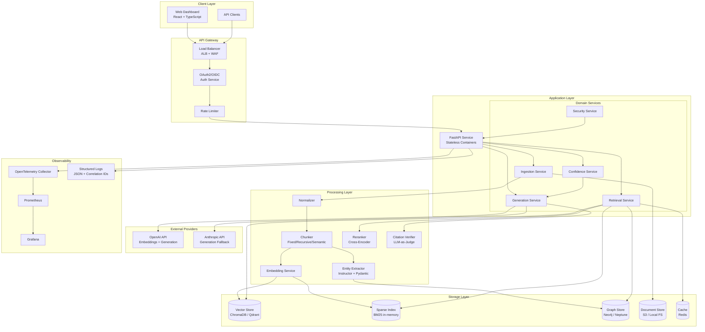
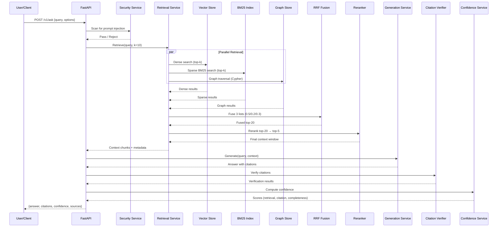
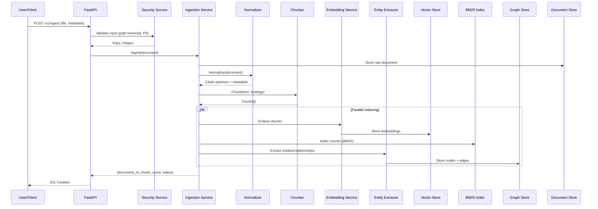
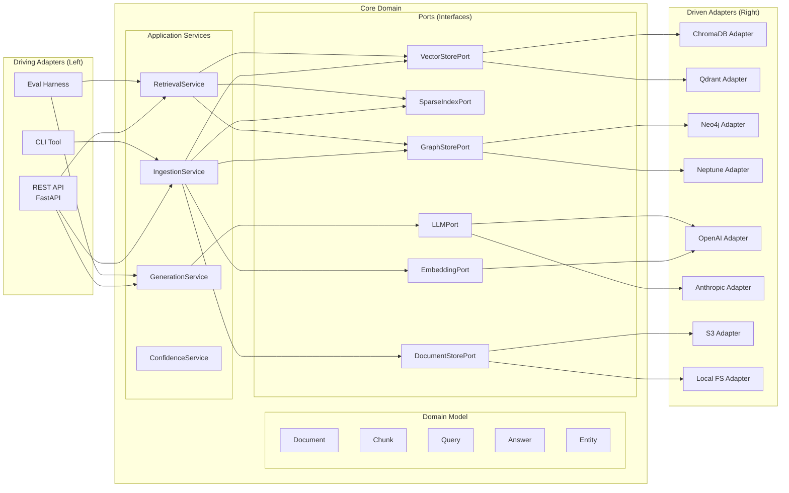

# Design Document: Production RAG Pipeline with Hybrid Search

## Overview

This design describes a production-grade Retrieval-Augmented Generation (RAG) system with three-way hybrid search combining dense vector retrieval, sparse BM25 keyword retrieval, and knowledge graph traversal. The system ingests multi-format documents, normalizes and chunks them using switchable strategies, indexes them across three stores (vector, sparse, graph), retrieves relevant context via Reciprocal Rank Fusion with cross-encoder reranking, and generates grounded answers with verifiable citations and confidence scores.

The architecture follows hexagonal (ports and adapters) principles to decouple core domain logic from infrastructure concerns, enabling swappable vector stores (ChromaDB/Qdrant), graph stores (Neo4j/Amazon Neptune), and LLM providers (OpenAI/Anthropic). The system is deployed as containerized services on AWS with Terraform IaC, GitLab CI/CD, and comprehensive observability via OpenTelemetry.

### Key Design Decisions

| Decision | Choice | Rationale |
|----------|--------|-----------|
| Architecture Pattern | Hexagonal (Ports & Adapters) | Enables swappable infrastructure without changing domain logic |
| Vector Store | ChromaDB (dev) / Qdrant (prod) | ChromaDB for local simplicity; Qdrant for production clustering |
| Graph Store | Neo4j (dev) / Amazon Neptune (prod) | Neo4j for local Cypher; Neptune for managed AWS integration |
| Embedding Model | OpenAI text-embedding-3-small | Good quality-to-cost ratio, 1536 dimensions |
| Sparse Retrieval | rank_bm25 (Python library) | Lightweight, no external dependency for BM25 |
| Fusion Algorithm | 3-way RRF (0.5 dense, 0.2 sparse, 0.3 graph) | Ranks-based fusion avoids score normalization issues |
| Reranker | cross-encoder/ms-marco-MiniLM-L-12-v2 | Local CPU inference, ~15ms/pair, no API cost |
| Entity Extraction | Instructor + Pydantic schemas | Type-safe structured output from any LLM provider |
| Generation Model | GPT-4o (primary) / Claude Sonnet (fallback) | GPT-4o for speed; Claude for fallback diversity |
| API Framework | FastAPI | Async, OpenAPI-native, Pydantic validation |
| Frontend | React + TypeScript | Component-based, accessible, well-tooled ecosystem |
| Observability | OpenTelemetry + Prometheus + Grafana | Vendor-neutral, industry standard |
| IaC | Terraform with modules | AWS-native, state locking, reusable modules |
| CI/CD | GitLab CI/CD | Reusable templates, environment promotion |

---

## Architecture

### High-Level System Architecture



### Request Flow: Query Pipeline



### Request Flow: Ingestion Pipeline



### Hexagonal Architecture (Ports & Adapters)



---

## Components and Interfaces

### 1. API Service (FastAPI)

The API service is the single entry point for all HTTP interactions. It validates requests against the OpenAPI schema, enforces authentication/authorization, applies rate limiting, and delegates to domain services.

**Endpoints:**

| Method | Path | Auth | Role | Description |
|--------|------|------|------|-------------|
| POST | /v1/ask | Required | reader+ | Submit query, get answer with citations |
| POST | /v1/ingest | Required | editor+ | Upload document for ingestion |
| GET | /v1/documents | Required | reader+ | List ingested documents |
| GET | /health | None | - | Liveness check |
| GET | /ready | None | - | Readiness check (dependencies) |

**Key Interfaces:**

```python
# api/routes/ask.py
@router.post("/v1/ask", response_model=AskResponse)
async def ask(
    request: AskRequest,
    user: AuthenticatedUser = Depends(get_current_user),
    retrieval_service: RetrievalService = Depends(),
    generation_service: GenerationService = Depends(),
    confidence_service: ConfidenceService = Depends(),
) -> AskResponse: ...

# api/routes/ingest.py
@router.post("/v1/ingest", response_model=IngestResponse, status_code=201)
async def ingest(
    file: UploadFile,
    strategy: ChunkingStrategy = ChunkingStrategy.RECURSIVE,
    user: AuthenticatedUser = Depends(get_current_user),
    ingestion_service: IngestionService = Depends(),
) -> IngestResponse: ...
```

### 2. Ingestion Service

Orchestrates the full document ingestion pipeline: validation → normalization → chunking → indexing → entity extraction.

```python
# domain/services/ingestion_service.py
class IngestionService:
    def __init__(
        self,
        normalizer: DocumentNormalizer,
        chunker: ChunkerFactory,
        indexing_service: IndexingService,
        entity_extractor: EntityExtractor,
        document_store: DocumentStorePort,
        event_bus: EventBus,
    ): ...

    async def ingest(
        self,
        document: RawDocument,
        strategy: ChunkingStrategy,
        correlation_id: str,
    ) -> IngestionResult: ...

    async def reindex(
        self,
        document_id: str,
        strategy: ChunkingStrategy,
    ) -> IngestionResult: ...
```

### 3. Document Normalizer

Converts raw documents (Markdown, HTML, PDF, plaintext) to clean plaintext with preserved metadata.

```python
# domain/processing/normalizer.py
class DocumentNormalizer:
    def normalize(self, raw: RawDocument) -> NormalizedDocument:
        """Convert to plaintext, preserve section headings, page numbers."""
        ...

class MarkdownNormalizer(FormatNormalizer):
    def normalize(self, content: bytes) -> NormalizedContent: ...

class HTMLNormalizer(FormatNormalizer):
    def normalize(self, content: bytes) -> NormalizedContent: ...

class PDFNormalizer(FormatNormalizer):
    def normalize(self, content: bytes) -> NormalizedContent: ...

class PlaintextNormalizer(FormatNormalizer):
    def normalize(self, content: bytes) -> NormalizedContent: ...
```

### 4. Chunker Factory

Produces chunks using the selected strategy. Implements the Strategy pattern.

```python
# domain/processing/chunking.py
class ChunkerFactory:
    def get_chunker(self, strategy: ChunkingStrategy) -> Chunker: ...

class FixedSizeChunker(Chunker):
    def __init__(self, chunk_size: int = 1000, overlap: int = 200): ...
    def chunk(self, document: NormalizedDocument) -> list[Chunk]: ...

class RecursiveChunker(Chunker):
    """Splits by section headers respecting document hierarchy."""
    def chunk(self, document: NormalizedDocument) -> list[Chunk]: ...

class SemanticChunker(Chunker):
    """Groups sentences by embedding similarity, splits at topic boundaries."""
    def __init__(self, similarity_threshold: float = 0.75): ...
    def chunk(self, document: NormalizedDocument) -> list[Chunk]: ...
```

### 5. Indexing Service

Coordinates writes to all three indexes (dense, sparse, graph) transactionally.

```python
# domain/services/indexing_service.py
class IndexingService:
    def __init__(
        self,
        vector_store: VectorStorePort,
        sparse_index: SparseIndexPort,
        graph_store: GraphStorePort,
        embedding_service: EmbeddingPort,
        deduplication_threshold: float = 0.95,
    ): ...

    async def index_chunks(
        self,
        chunks: list[Chunk],
        entities: list[ExtractedEntity],
        relationships: list[ExtractedRelationship],
    ) -> IndexingResult: ...

    async def remove_document_entries(self, document_id: str) -> None: ...

    async def check_duplicate(self, chunk: Chunk) -> DuplicationResult: ...
```

### 6. Retrieval Service

Executes three-way hybrid search, applies RRF fusion, and reranks.

```python
# domain/services/retrieval_service.py
class RetrievalService:
    def __init__(
        self,
        vector_store: VectorStorePort,
        sparse_index: SparseIndexPort,
        graph_store: GraphStorePort,
        reranker: RerankerPort,
        embedding_service: EmbeddingPort,
        cache: CachePort,
        rrf_weights: RRFWeights = RRFWeights(dense=0.5, sparse=0.2, graph=0.3),
    ): ...

    async def retrieve(
        self,
        query: Query,
        top_k: int = 10,
        rerank_top_n: int = 20,
        final_k: int = 5,
        weights_override: RRFWeights | None = None,
    ) -> RetrievalResult: ...

    def fuse_results(
        self,
        dense_results: list[ScoredChunk],
        sparse_results: list[ScoredChunk],
        graph_results: list[ScoredChunk],
        weights: RRFWeights,
        k: int = 60,
    ) -> list[ScoredChunk]: ...
```

**RRF Algorithm:**

```python
def reciprocal_rank_fusion(
    ranked_lists: list[list[ScoredChunk]],
    weights: list[float],
    k: int = 60,
) -> list[ScoredChunk]:
    """
    Fuse multiple ranked lists using weighted Reciprocal Rank Fusion.
    
    For each document d across all lists:
      RRF_score(d) = Σ (weight_i / (k + rank_i(d)))
    
    where rank_i(d) is the rank of d in list i (1-indexed),
    and k is a smoothing constant (default 60).
    """
    scores: dict[str, float] = {}
    chunk_map: dict[str, ScoredChunk] = {}
    
    for weight, ranked_list in zip(weights, ranked_lists):
        for rank, chunk in enumerate(ranked_list, start=1):
            chunk_id = chunk.chunk_id
            scores[chunk_id] = scores.get(chunk_id, 0.0) + weight / (k + rank)
            chunk_map[chunk_id] = chunk
    
    sorted_ids = sorted(scores.keys(), key=lambda cid: scores[cid], reverse=True)
    return [chunk_map[cid] for cid in sorted_ids]
```

### 7. Entity Extractor

Uses Instructor + Pydantic schemas to extract typed entities and relationships from chunks via LLM structured output.

```python
# domain/processing/entity_extractor.py
class EntityExtractor:
    def __init__(self, llm_client: instructor.Instructor): ...

    async def extract(
        self, chunk: Chunk
    ) -> tuple[list[ExtractedEntity], list[ExtractedRelationship]]:
        """Extract entities and relationships using structured LLM output."""
        response = await self.llm_client.create(
            response_model=ExtractionResult,
            messages=[
                {"role": "system", "content": EXTRACTION_SYSTEM_PROMPT},
                {"role": "user", "content": chunk.text},
            ],
        )
        return response.entities, response.relationships

class ExtractionResult(BaseModel):
    entities: list[ExtractedEntity]
    relationships: list[ExtractedRelationship]
```

### 8. Generation Service

Produces grounded answers with citations using the context window.

```python
# domain/services/generation_service.py
class GenerationService:
    def __init__(
        self,
        primary_llm: LLMPort,
        fallback_llm: LLMPort | None,
        citation_verifier: CitationVerifier,
        max_tokens: int = 4096,
        token_budget: TokenBudget,
    ): ...

    async def generate(
        self,
        query: Query,
        context: list[ScoredChunk],
        correlation_id: str,
    ) -> GenerationResult: ...

    async def verify_citations(
        self,
        answer: str,
        citations: list[Citation],
        context: list[ScoredChunk],
    ) -> CitationVerificationResult: ...
```

### 9. Confidence Service

Computes multi-dimensional confidence scores.

```python
# domain/services/confidence_service.py
class ConfidenceService:
    def __init__(
        self,
        retrieval_threshold: float = 0.3,
        citation_weight: float = 0.4,
        retrieval_weight: float = 0.35,
        completeness_weight: float = 0.25,
    ): ...

    def compute_confidence(
        self,
        retrieval_scores: list[float],
        citation_result: CitationVerificationResult,
        query_coverage: float,
    ) -> ConfidenceScore: ...

    def should_fallback(self, score: ConfidenceScore) -> bool: ...
```

### 10. Security Service

Handles prompt injection detection, PII scanning, and input validation.

```python
# domain/services/security_service.py
class SecurityService:
    def __init__(
        self,
        injection_patterns: list[Pattern],
        pii_detector: PIIDetector,
    ): ...

    def scan_query(self, query: str) -> SecurityScanResult: ...
    def scan_document(self, document: RawDocument) -> SecurityScanResult: ...
    def validate_filename(self, filename: str) -> bool: ...
```

### Port Interfaces (Driven Ports)

```python
# ports/vector_store.py
class VectorStorePort(Protocol):
    async def store(self, embeddings: list[EmbeddingRecord]) -> None: ...
    async def search(self, query_vector: list[float], top_k: int) -> list[ScoredChunk]: ...
    async def delete_by_document(self, document_id: str) -> None: ...
    async def find_similar(self, vector: list[float], threshold: float) -> list[ScoredChunk]: ...

# ports/sparse_index.py
class SparseIndexPort(Protocol):
    async def index(self, chunks: list[Chunk]) -> None: ...
    async def search(self, query: str, top_k: int) -> list[ScoredChunk]: ...
    async def delete_by_document(self, document_id: str) -> None: ...

# ports/graph_store.py
class GraphStorePort(Protocol):
    async def store_entities(self, entities: list[ExtractedEntity]) -> None: ...
    async def store_relationships(self, relationships: list[ExtractedRelationship]) -> None: ...
    async def traverse(self, query: str, max_hops: int = 2) -> list[ScoredChunk]: ...
    async def delete_by_document(self, document_id: str) -> None: ...

# ports/embedding.py
class EmbeddingPort(Protocol):
    async def embed(self, texts: list[str]) -> list[list[float]]: ...
    async def embed_single(self, text: str) -> list[float]: ...

# ports/llm.py
class LLMPort(Protocol):
    async def generate(self, messages: list[Message], max_tokens: int) -> LLMResponse: ...
    async def generate_structured(self, messages: list[Message], schema: type[BaseModel]) -> BaseModel: ...

# ports/document_store.py
class DocumentStorePort(Protocol):
    async def store(self, document: RawDocument) -> str: ...
    async def retrieve(self, document_id: str) -> RawDocument: ...
    async def list_documents(self, filters: DocumentFilters) -> list[DocumentMetadata]: ...
    async def delete(self, document_id: str) -> None: ...

# ports/reranker.py
class RerankerPort(Protocol):
    async def rerank(self, query: str, candidates: list[ScoredChunk], top_n: int) -> list[ScoredChunk]: ...

# ports/cache.py
class CachePort(Protocol):
    async def get(self, key: str) -> Any | None: ...
    async def set(self, key: str, value: Any, ttl: int) -> None: ...
    async def invalidate(self, pattern: str) -> None: ...
```

---

## Data Models

### Core Domain Entities

```python
from pydantic import BaseModel, Field
from enum import Enum
from datetime import datetime
from uuid import UUID

# --- Enums ---

class DocumentFormat(str, Enum):
    MARKDOWN = "markdown"
    PLAINTEXT = "plaintext"
    HTML = "html"
    PDF = "pdf"

class ChunkingStrategy(str, Enum):
    FIXED_SIZE = "fixed_size"
    RECURSIVE = "recursive"
    SEMANTIC = "semantic"

class UserRole(str, Enum):
    READER = "reader"
    EDITOR = "editor"
    ADMIN = "admin"

# --- Documents ---

class RawDocument(BaseModel):
    id: UUID
    filename: str
    format: DocumentFormat
    content: bytes
    uploaded_by: str
    uploaded_at: datetime
    size_bytes: int

class NormalizedDocument(BaseModel):
    id: UUID
    source_document_id: UUID
    plaintext: str
    sections: list["Section"]
    metadata: "DocumentMetadata"

class Section(BaseModel):
    heading: str
    level: int
    start_offset: int
    end_offset: int
    page_number: int | None = None

class DocumentMetadata(BaseModel):
    source_path: str
    format: DocumentFormat
    page_count: int | None = None
    ingested_at: datetime
    chunk_count: int = 0

# --- Chunks ---

class Chunk(BaseModel):
    id: UUID
    document_id: UUID
    index: int
    text: str
    section_heading: str
    strategy: ChunkingStrategy
    char_count: int
    metadata: dict[str, Any] = {}

class ScoredChunk(BaseModel):
    chunk: Chunk
    score: float
    retrieval_method: str  # "dense", "sparse", "graph", "fused"

class EmbeddingRecord(BaseModel):
    chunk_id: UUID
    document_id: UUID
    vector: list[float]
    metadata: dict[str, Any]

# --- Knowledge Graph ---

class ExtractedEntity(BaseModel):
    id: UUID
    name: str
    entity_type: str  # e.g., "Person", "Concept", "Technology"
    description: str
    source_chunk_id: UUID
    properties: dict[str, Any] = {}

class ExtractedRelationship(BaseModel):
    id: UUID
    source_entity_id: UUID
    target_entity_id: UUID
    relationship_type: str  # e.g., "USES", "DEPENDS_ON", "PART_OF"
    description: str
    source_chunk_id: UUID
    properties: dict[str, Any] = {}

# --- Query & Response ---

class Query(BaseModel):
    text: str
    top_k: int = 10
    rrf_weights: "RRFWeights | None" = None
    include_graph: bool = True

class RRFWeights(BaseModel):
    dense: float = 0.5
    sparse: float = 0.2
    graph: float = 0.3

    def validate_sum(self) -> bool:
        return abs(self.dense + self.sparse + self.graph - 1.0) < 0.001

class Citation(BaseModel):
    index: int  # [1], [2], etc.
    chunk_id: UUID
    claim: str
    source_text: str
    verified: bool = False
    verification_score: float | None = None

class ConfidenceScore(BaseModel):
    retrieval_confidence: float  # 0.0 - 1.0
    citation_coverage: float    # 0.0 - 1.0
    answer_completeness: float  # 0.0 - 1.0
    composite: float            # weighted combination

class GenerationResult(BaseModel):
    answer: str
    citations: list[Citation]
    context_chunks: list[ScoredChunk]
    confidence: ConfidenceScore
    is_fallback: bool = False
    fallback_info: "FallbackInfo | None" = None

class FallbackInfo(BaseModel):
    found: list[str]
    not_found: list[str]
    suggested_documents: list[str]

# --- API Request/Response Models ---

class AskRequest(BaseModel):
    query: str = Field(..., min_length=1, max_length=2000)
    top_k: int = Field(default=10, ge=1, le=50)
    rrf_weights: RRFWeights | None = None
    include_graph: bool = True

class AskResponse(BaseModel):
    answer: str
    citations: list[Citation]
    confidence: ConfidenceScore
    sources: list[SourceReference]
    correlation_id: str
    degraded_mode: list[str] = []

class SourceReference(BaseModel):
    document_id: UUID
    document_name: str
    section: str
    relevance_score: float
    retrieval_method: str

class IngestResponse(BaseModel):
    document_id: UUID
    filename: str
    format: DocumentFormat
    chunk_count: int
    entity_count: int
    status: str
    correlation_id: str

class ErrorResponse(BaseModel):
    error_code: str
    message: str
    correlation_id: str
    details: dict[str, Any] = {}

# --- Events ---

class DocumentIngestedEvent(BaseModel):
    document_id: UUID
    format: DocumentFormat
    size_bytes: int
    timestamp: datetime
    chunk_count: int
    entity_count: int

# --- Evaluation ---

class EvalPair(BaseModel):
    question: str
    expected_answer: str
    category: str  # "simple_lookup", "multi_hop", "no_answer", "ambiguous"

class EvalResult(BaseModel):
    question: str
    generated_answer: str
    correctness: float
    faithfulness: float
    retrieval_relevance: float
    citation_accuracy: float
    chunking_strategy: ChunkingStrategy
    timestamp: datetime
    pipeline_version: str
```

### Database Schemas

**Vector Store (Qdrant collection schema):**

```json
{
  "collection_name": "document_chunks",
  "vectors": {
    "size": 1536,
    "distance": "Cosine"
  },
  "payload_schema": {
    "document_id": "keyword",
    "chunk_index": "integer",
    "section_heading": "text",
    "strategy": "keyword",
    "char_count": "integer",
    "text": "text"
  }
}
```

**Graph Store (Neo4j schema):**

```cypher
// Node labels
(:Entity {id, name, type, description, source_chunk_id, properties})
(:Chunk {id, document_id, index, section_heading})
(:Document {id, filename, format, ingested_at})

// Relationship types
(:Entity)-[:RELATES_TO {type, description, source_chunk_id}]->(:Entity)
(:Entity)-[:EXTRACTED_FROM]->(:Chunk)
(:Chunk)-[:BELONGS_TO]->(:Document)
```

---

## Correctness Properties

*A property is a characteristic or behavior that should hold true across all valid executions of a system—essentially, a formal statement about what the system should do. Properties serve as the bridge between human-readable specifications and machine-verifiable correctness guarantees.*

### Property 1: Normalization preserves document metadata

*For any* valid document in a supported format (Markdown, HTML, PDF, plaintext) containing section headings and page numbers, normalizing the document to plaintext SHALL produce output that preserves all section headings and page numbers from the original.

**Validates: Requirements 1.2**

### Property 2: Raw document storage round-trip

*For any* valid document that is successfully ingested, storing the raw document and then retrieving it SHALL produce content byte-identical to the original submission.

**Validates: Requirements 1.3**

### Property 3: Successful ingestion produces correct domain event

*For any* valid document in a supported format that is successfully ingested, the system SHALL emit a domain event containing the correct document identifier, format, size in bytes, and a timestamp within the request window.

**Validates: Requirements 1.1, 1.6**

### Property 4: Fixed-size chunker size and overlap invariants

*For any* text and valid configuration (chunk_size > 0, overlap >= 0, overlap < chunk_size), the fixed-size chunker SHALL produce chunks where: (a) no chunk exceeds chunk_size characters, (b) consecutive chunks overlap by exactly the configured overlap characters, and (c) the concatenation of non-overlapping portions reconstructs the original text.

**Validates: Requirements 2.3**

### Property 5: Recursive chunker respects section boundaries

*For any* document with identifiable section headers, the recursive chunker SHALL produce chunks where no chunk spans across a section boundary—each chunk's text is contained within a single section or subsection.

**Validates: Requirements 2.4**

### Property 6: Semantic chunker splits at similarity threshold

*For any* sequence of sentences with computed pairwise embedding similarities, the semantic chunker SHALL split between consecutive sentences only where similarity drops below the configured threshold, and SHALL NOT split where similarity remains at or above the threshold.

**Validates: Requirements 2.5**

### Property 7: All chunks carry required metadata

*For any* document processed by any chunking strategy, every produced chunk SHALL contain: source_document_id, chunk_index (sequential starting from 0), section_heading, chunking_strategy name, and char_count matching len(chunk.text).

**Validates: Requirements 2.2, 2.7**

### Property 8: Re-chunking produces valid output from stored content

*For any* previously ingested document, re-chunking with a different strategy SHALL produce a new set of valid chunks from the stored raw content, and the union of text from new chunks SHALL cover the same content as the union of text from the original chunks.

**Validates: Requirements 2.6**

### Property 9: Deduplication rejects near-duplicate chunks

*For any* two chunks whose embedding vectors have cosine similarity greater than 0.95, the indexing service SHALL flag the second chunk as a duplicate. *For any* two chunks with cosine similarity at or below 0.95, both SHALL be accepted.

**Validates: Requirements 3.4**

### Property 10: RRF fusion with configurable weights

*For any* three non-empty ranked lists (dense, sparse, graph) and valid weights summing to 1.0, the RRF fusion SHALL: (a) include every unique item from all input lists in the output, (b) assign scores using the formula score(d) = Σ(weight_i / (k + rank_i)), and (c) produce output sorted by descending RRF score. When custom weights are provided, the fusion SHALL use those weights instead of defaults.

**Validates: Requirements 4.3, 4.6**

### Property 11: Reranker selection maintains ordering

*For any* list of N candidates (N >= 5) scored by the reranker, selecting the top 5 SHALL return exactly the 5 candidates with the highest reranker scores, in descending score order.

**Validates: Requirements 4.4**

### Property 12: Retrieval results include required metadata

*For any* retrieval result returned to the caller, every scored chunk SHALL include: source_document identifier, section_heading, relevance_score (>= 0), and retrieval_method (one of "dense", "sparse", "graph", "fused").

**Validates: Requirements 4.5**

### Property 13: Citation format correctness

*For any* generated answer containing citations, all citation references SHALL match the pattern [N] where N is a positive integer, and every referenced N SHALL correspond to a valid chunk in the context window (1-indexed).

**Validates: Requirements 5.2**

### Property 14: Citation verification and scoring

*For any* answer with citations and a set of source chunks, the citation verifier SHALL: (a) correctly identify citations as supported when the claim is semantically entailed by the source chunk, and (b) reduce the citation_coverage score proportionally for each unsupported citation (coverage = verified_count / total_citations).

**Validates: Requirements 5.4, 5.5**

### Property 15: Token budget enforcement

*For any* generation request, the total tokens consumed (prompt + completion) SHALL NOT exceed the configured maximum token budget for that request.

**Validates: Requirements 5.8**

### Property 16: Prompt injection detection

*For any* input string that matches known direct prompt injection patterns (system prompt override attempts, instruction injection, role-play attacks), the security service SHALL reject the input. *For any* benign query string not matching injection patterns, the security service SHALL accept it.

**Validates: Requirements 5.9, 11.1**

### Property 17: Confidence score structure and validity

*For any* computed confidence result, the output SHALL contain: retrieval_confidence in [0, 1], citation_coverage in [0, 1], answer_completeness in [0, 1], and a composite score in [0, 1] that equals the weighted sum of the three dimensions using configured weights.

**Validates: Requirements 6.1, 6.2, 6.6**

### Property 18: Low confidence triggers fallback

*For any* response where retrieval_confidence is below the configured threshold (including zero), the system SHALL trigger a fallback response and SHALL NOT present it as a confident answer. The fallback SHALL include structured information about what was found, what was not found, and suggested documents.

**Validates: Requirements 6.3, 6.5**

### Property 19: API input validation rejects invalid requests

*For any* request payload that violates the OpenAPI schema constraints (missing required fields, invalid types, values outside defined ranges), the API SHALL return HTTP 422 with a structured error indicating which validation rules were violated.

**Validates: Requirements 8.7**

### Property 20: Error responses contain required structure

*For any* error response from the API (4xx or 5xx), the response body SHALL contain: error_code (non-empty string), message (human-readable), and correlation_id (non-empty string matching UUID format).

**Validates: Requirements 8.8, 8.10**

---

## Error Handling

### Error Handling Strategy

The system uses a layered error handling approach with circuit breakers, retries, graceful degradation, and structured error responses.

### Circuit Breaker Pattern

```python
# infrastructure/resilience/circuit_breaker.py
class CircuitBreaker:
    """
    States: CLOSED → OPEN → HALF_OPEN → CLOSED
    
    - CLOSED: Normal operation, counting failures
    - OPEN: All calls fail fast, timer running
    - HALF_OPEN: Allow one probe call to test recovery
    """
    def __init__(
        self,
        failure_threshold: int = 5,
        recovery_timeout: float = 30.0,
        success_threshold: int = 2,
    ): ...

    async def call(self, func: Callable, *args, **kwargs) -> Any: ...
```

### Graceful Degradation Matrix

| Component Failure | Degraded Behavior | User Impact |
|-------------------|-------------------|-------------|
| BM25 Index unavailable | Dense + Graph retrieval only | Slightly reduced keyword matching |
| Graph Store unavailable | Dense + Sparse retrieval only | No multi-hop reasoning |
| Generation Model unavailable | Return retrieval results without answer | User sees sources but no synthesized answer |
| Embedding Model unavailable | Queue ingestion, block new queries | Temporary ingestion halt |
| Vector Store unavailable | Full retrieval failure | Error returned to user |
| Reranker unavailable | Return RRF-fused results without reranking | Slightly lower precision |

### Retry Strategy

```python
# infrastructure/resilience/retry.py
class RetryConfig:
    max_retries: int = 3
    base_delay: float = 1.0
    max_delay: float = 30.0
    jitter: bool = True  # Prevent thundering herd
    retryable_exceptions: tuple[type[Exception], ...] = (
        ConnectionError,
        TimeoutError,
        RateLimitError,
    )

async def retry_with_backoff(
    func: Callable,
    config: RetryConfig,
    correlation_id: str,
) -> Any:
    """Exponential backoff with jitter: delay = min(base * 2^attempt + jitter, max_delay)"""
    ...
```

### Structured Error Responses

All errors follow a consistent format with correlation IDs for traceability:

```python
# Error code taxonomy
ERROR_CODES = {
    # Client errors (4xx)
    "VALIDATION_ERROR": 422,       # Schema validation failure
    "AUTH_REQUIRED": 401,          # Missing or invalid token
    "FORBIDDEN": 403,             # Insufficient permissions
    "NOT_FOUND": 404,             # Resource not found
    "RATE_LIMITED": 429,          # Rate limit exceeded
    "UNSUPPORTED_FORMAT": 422,    # Unsupported document format
    "INJECTION_DETECTED": 400,    # Prompt injection attempt
    "PATH_TRAVERSAL": 400,        # Path traversal in filename
    
    # Server errors (5xx)
    "RETRIEVAL_FAILURE": 503,     # Vector store unavailable
    "GENERATION_FAILURE": 503,    # LLM provider unavailable
    "INTERNAL_ERROR": 500,        # Unhandled exception
    "TIMEOUT": 504,               # Operation timed out
    "CIRCUIT_OPEN": 503,          # Circuit breaker tripped
}
```

### Token Budget Management

```python
# domain/services/token_budget.py
class TokenBudget:
    def __init__(
        self,
        max_per_request: int = 8192,
        max_per_user_daily: int = 100_000,
        max_system_daily: int = 1_000_000,
        alert_threshold: float = 0.8,  # Alert at 80% usage
    ): ...

    def check_budget(self, user_id: str, estimated_tokens: int) -> BudgetCheck: ...
    def record_usage(self, user_id: str, tokens_used: int, provider: str) -> None: ...
```

---

## Testing Strategy

### Dual Testing Approach

This system uses both **property-based tests** and **example-based unit tests** for comprehensive coverage:

- **Property-based tests** verify universal correctness properties across randomly generated inputs (100+ iterations each). They are the primary validation for core algorithms (RRF fusion, chunking, deduplication, confidence scoring, input validation).
- **Example-based unit tests** verify specific scenarios, edge cases, error conditions, and integration points with concrete inputs.

### Property-Based Testing Configuration

**Library:** [Hypothesis](https://hypothesis.readthedocs.io/) (Python)

**Configuration:**
- Minimum 100 examples per property test (configurable via `@settings(max_examples=100)`)
- Each test tagged with feature and property reference
- Tag format: `# Feature: production-rag-pipeline-hybrid-search, Property N: <title>`

**Properties to implement (20 total):**

| # | Property | Primary Module Under Test |
|---|----------|--------------------------|
| 1 | Normalization preserves metadata | `domain/processing/normalizer.py` |
| 2 | Raw document storage round-trip | `domain/services/ingestion_service.py` |
| 3 | Ingestion produces correct event | `domain/services/ingestion_service.py` |
| 4 | Fixed-size chunk invariants | `domain/processing/chunking.py` |
| 5 | Recursive chunker section boundaries | `domain/processing/chunking.py` |
| 6 | Semantic chunker threshold splits | `domain/processing/chunking.py` |
| 7 | Chunks carry required metadata | `domain/processing/chunking.py` |
| 8 | Re-chunking from stored content | `domain/services/ingestion_service.py` |
| 9 | Deduplication threshold | `domain/services/indexing_service.py` |
| 10 | RRF fusion correctness | `domain/services/retrieval_service.py` |
| 11 | Reranker selection ordering | `domain/services/retrieval_service.py` |
| 12 | Retrieval metadata completeness | `domain/services/retrieval_service.py` |
| 13 | Citation format correctness | `domain/services/generation_service.py` |
| 14 | Citation verification scoring | `domain/services/generation_service.py` |
| 15 | Token budget enforcement | `domain/services/generation_service.py` |
| 16 | Prompt injection detection | `domain/services/security_service.py` |
| 17 | Confidence score validity | `domain/services/confidence_service.py` |
| 18 | Low confidence fallback | `domain/services/confidence_service.py` |
| 19 | API input validation | `api/routes/*.py` |
| 20 | Error response structure | `api/middleware/error_handler.py` |

### Example-Based Unit Tests

Focus areas:
- Specific format normalization (known Markdown → plaintext conversions)
- Edge cases: empty documents, single-character chunks, maximum-size payloads
- Integration contracts: mock-based tests for each port/adapter
- Security: known injection patterns, path traversal variants
- Fallback scenarios: specific degradation paths

### Integration Tests

- Full ingestion pipeline with real (local) vector store and graph store
- End-to-end query pipeline with seeded corpus
- Circuit breaker behavior under simulated failures
- Transactional indexing rollback on partial failure
- Auth/RBAC enforcement across all endpoints

### End-to-End Tests

- Playwright tests for Web UI (desktop + mobile viewpoints)
- API contract tests against OpenAPI spec (Schemathesis)
- Full query flow: ingest → retrieve → generate → verify citations

### Performance Tests

- k6 load tests validating p95 latency SLOs
- Ingestion throughput benchmarks
- Concurrent query capacity testing

### Security Tests

- SAST (Semgrep/Bandit), SCA, DAST (OWASP ZAP)
- Fuzzing on ingest/ask endpoints
- Container image scanning (Trivy)
- IaC scanning (Checkov)

### Evaluation Suite

- Golden dataset: 50+ Q&A pairs across 4 categories
- Metrics: correctness, faithfulness, retrieval relevance, citation accuracy
- Chunking strategy comparison reports
- Regression detection with configurable tolerance thresholds
- Results exported to Parquet with timestamps and pipeline versions

### Test Pyramid Summary

```
           ╱╲
          ╱  ╲         E2E / Playwright / Performance
         ╱────╲
        ╱      ╲       Integration (ports, pipelines, auth)
       ╱────────╲
      ╱          ╲     Property-Based (20 core properties, 100+ iterations)
     ╱────────────╲
    ╱              ╲    Unit / Example-Based (edge cases, mocks)
   ╱────────────────╲
```
