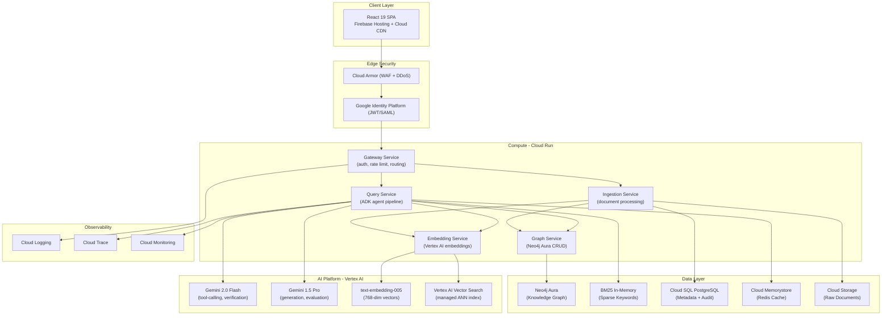

# Production RAG Pipeline with Hybrid Search — GCP Edition

A production-grade Retrieval-Augmented Generation (RAG) system deployed on **Google Cloud Platform**, leveraging **Vertex AI**, **Google ADK**, and **Cloud Run**. Ingests internal documentation, indexes across three complementary stores, and answers natural language questions with grounded, cited responses and confidence scoring.

Designed for regulated industries (banking, financial services, compliance) where auditability, data sovereignty, and answer verifiability are requirements.

---

## Architecture (GCP Native)



---

## Quick Start (Local Development)

### Prerequisites
- Python 3.11+
- Node.js 18+ (frontend)
- Docker + Docker Compose
- Google Cloud SDK (`gcloud` CLI)
- GCP project with Vertex AI API enabled

### Setup

```bash
# 1. Clone and install
git clone <repository-url> && cd legislation-rag-platform
pip install -e ".[dev,test]"

# 2. Authenticate with GCP
gcloud auth application-default login
gcloud config set project YOUR_PROJECT_ID

# 3. Start local infrastructure
docker compose up -d

# 4. Configure environment
cp .env.example .env  # Edit with your GCP project settings

# 5. Run API server
uvicorn src.api.app:create_app --factory --host 0.0.0.0 --port 8080 --reload

# 6. Run frontend
cd frontend && npm install && npm run dev

# 7. Run tests
pytest tests/unit tests/property -v
```

### .env.example

```bash
GOOGLE_CLOUD_PROJECT=your-project-id
GCP_REGION=australia-southeast1
VERTEX_AI_MODEL_FLASH=gemini-2.0-flash
VERTEX_AI_MODEL_PRO=gemini-1.5-pro
VERTEX_AI_EMBEDDING_MODEL=text-embedding-005
VERTEX_AI_TEMPERATURE=0.1
NEO4J_URI=bolt://localhost:7687
REDIS_URL=redis://localhost:6379
API_KEYS=dev-api-key
VITE_API_BASE_URL=http://localhost:8080
LOG_LEVEL=info
```

---

## API Endpoints

| Method | Path | Description | Timeout |
|--------|------|-------------|---------|
| POST | `/v1/agents/ask` | Full ADK agent pipeline | 30s |
| POST | `/v1/ask` | Direct retrieval-only | 30s |
| POST | `/v1/ingest` | Document upload | 60s |
| GET | `/v1/documents` | List documents | 5s |
| GET | `/health` | Aggregated health | 5s |

### Example

```bash
curl -X POST http://localhost:8080/v1/agents/ask \
  -H "Content-Type: application/json" \
  -H "X-API-Key: dev-api-key" \
  -d '{"query": "What are the ID verification requirements for high-risk customers?"}'
```

---

## Project Structure

```
legislation-rag-platform/
├── src/                    # Core monolith (hexagonal architecture)
│   ├── agents/             # Google ADK agent definitions
│   ├── api/                # FastAPI application
│   ├── domain/             # Pure business logic
│   ├── infrastructure/     # GCP adapters
│   └── ports/              # Protocol interfaces
├── services/               # Cloud Run microservices
├── libs/                   # Shared libraries
├── frontend/               # React 19 SPA
├── infrastructure/         # Terraform (Google provider)
├── tests/                  # Test suite
├── pyproject.toml
├── docker-compose.yml
└── .gitlab-ci.yml
```

---

## Deployment

```bash
# Build and push
gcloud builds submit --tag REGION-docker.pkg.dev/PROJECT/repo/service:TAG

# Deploy to Cloud Run
gcloud run deploy query-service \
  --image REGION-docker.pkg.dev/PROJECT/repo/query-service:TAG \
  --region australia-southeast1 \
  --min-instances 2 --max-instances 15

# Terraform
cd infrastructure/environments/prod && terraform apply
```

---

## Key Decisions

1. **Google ADK** — Native Vertex AI agent orchestration with SequentialAgent
2. **Vertex AI Vector Search** — Managed ANN, auto-scaling
3. **Cloud Run** — Scale-to-zero, per-request billing
4. **Gemini tiered models** — Flash (cheap) + Pro (reasoning)
5. **Hexagonal architecture** — Vendor-independent domain logic
6. **Workload Identity** — Zero static credentials
7. **Data sovereignty** — All data in `australia-southeast1`
