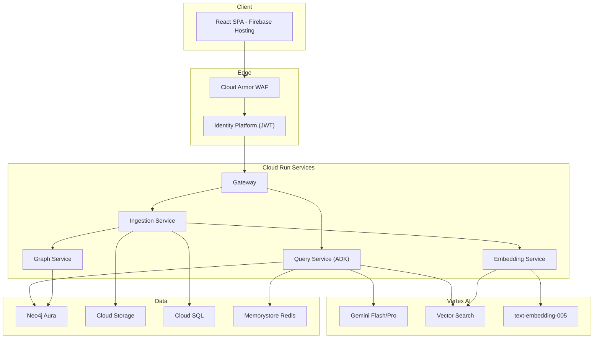

# Full Stack Developer — GCP System Architecture & Interview Guide

## Role: Full Stack Developer (React / Python / AI Platform)
## Platform: Google Cloud — Vertex AI + Google ADK + Cloud Run
## Domain: Internal Staff-Facing SPAs — GraphRAG-Enabled AI Search

---

# PART A: COMPLETE SYSTEM TECH SPEC (GCP NATIVE)

## 1. Executive Summary

This platform delivers a GraphRAG-powered librarian as a web application to internal government staff, enabling them to query complex legislative relationships in natural language and receive grounded, cited answers in seconds. Deployed entirely on Google Cloud Platform using Vertex AI, Google ADK, and Cloud Run.

### Technology Table (GCP Stack)

| Technology | Category | Why Selected | Where It Runs |
|:---|:---|:---|:---|
| **React 19 + Vite 6** | Frontend | Sub-second HMR, streaming LLM UI | Firebase Hosting + Cloud CDN |
| **TypeScript 5.7** | Type System | Compile-time safety, strict mode | Build-time |
| **TailwindCSS 4** | Styling | Utility-first, confidence color tokens | Build output |
| **TanStack Query 5** | Server State | Cache invalidation, optimistic updates | Client runtime |
| **FastAPI** | Backend API | Native async, OpenAPI, Pydantic-native | Cloud Run |
| **Pydantic v2** | Validation | Rust-speed runtime enforcement | Backend runtime |
| **Vertex AI (Gemini)** | AI Platform | Unified LLM + embeddings + eval, AU region | GCP Managed |
| **Google ADK** | Agent Framework | SequentialAgent, typed tools, A2A HTTP | Cloud Run |
| **Neo4j Aura** | Graph Database | Cypher traversal, managed HA | GCP Marketplace |
| **Vertex AI Vector Search** | Vector Store | Managed ANN, streaming updates | GCP Managed |
| **Cloud SQL (PostgreSQL)** | Relational DB | Audit logs, metadata, HITL queue | GCP Managed |
| **Cloud Memorystore** | Cache | Sub-ms reads, rate limiting | GCP Managed |
| **Cloud Run** | Compute | Scale-to-zero, per-request billing | GCP Serverless |
| **Cloud Run Jobs** | Batch | Document parsing, batch embedding | GCP Serverless |
| **Terraform** | IaC | Google provider, env promotion | CI/CD pipeline |
| **Google Identity Platform** | Auth | SAML, MFA, JWT | GCP Managed |
| **Cloud Armor** | WAF/DDoS | OWASP rules, rate limiting | GCP Edge |
| **Cloud Storage** | Object Store | Raw documents, lifecycle | GCP Managed |
| **Secret Manager** | Secrets | IAM-gated, versioned | GCP Managed |
| **Cross-Encoder** | ML Model | ms-marco-MiniLM, local inference | Cloud Run container |
| **GitLab CI/CD** | Pipeline | lint, test, security, build, deploy | GitLab Runners |

---

## 2. Architecture



---

## 3. Google ADK Agent Pipeline

```python
from google.adk import Agent, SequentialAgent
from google.adk.models import Gemini

retrieval_agent = Agent(
    name="retrieval",
    model=Gemini(model="gemini-2.0-flash", temperature=0.1),
    tools=[dense_search, sparse_search, graph_search, rrf_fuse, rerank],
    instruction="Execute hybrid search with RRF fusion..."
)

generation_agent = Agent(
    name="generation",
    model=Gemini(model="gemini-1.5-pro", temperature=0.1),
    tools=[format_context, generate_answer, extract_citations, compute_confidence],
    instruction="Generate grounded answer with [N] citations..."
)

citation_agent = Agent(
    name="citation_verification",
    model=Gemini(model="gemini-2.0-flash", temperature=0.0),
    tools=[verify_claim_pair],
    instruction="Verify each citation against source chunk..."
)

pipeline = SequentialAgent(
    name="rag_pipeline",
    sub_agents=[retrieval_agent, generation_agent, citation_agent],
)
```

---

## 4. Frontend (Cloud-Agnostic)

Same React 19 patterns — frontend code unchanged. Only deployment target and API URL differ:
- Deploy to Firebase Hosting (automatic CDN)
- `VITE_API_BASE_URL` points to Cloud Run gateway URL
- Auth tokens from Google Identity Platform instead of Cognito

---

## 5. Security (GCP Native)

- **Edge:** Cloud Armor WAF (OWASP, geo-fence AU, rate limit)
- **Auth:** Google Identity Platform (SAML SSO, MFA, JWT)
- **Service Identity:** Workload Identity (zero static credentials)
- **Secrets:** Secret Manager (versioned, IAM-gated)
- **Prompt Safety:** Vertex AI Safety Settings + regex detection
- **Data:** Encryption at rest (CMEK optional), TLS automatic on Cloud Run

---

# PART B: STARR INTERVIEW RESPONSES (GCP-Anchored)

## Q1: Tell me about yourself

**Action:** Built production RAG platform on GCP with 5 Google ADK agents on Cloud Run, Vertex AI Gemini tiered models (80% cost savings), hybrid search via Vertex AI Vector Search + BM25 + Neo4j Aura, React 19 frontend on Firebase Hosting. Hexagonal architecture enabled AWS-to-GCP migration touching only adapter layer.

**Result:** Sub-5s compliance answers, scale-to-zero (50% cost reduction), zero static credentials via Workload Identity.

---

## Q9: High-concurrency optimization on Cloud Run

**Action:**
1. Cloud Run concurrency=10 for Query Service (CPU-intensive 30s pipeline)
2. asyncio.gather() for parallel search across 3 methods
3. Min-instances=2 eliminates cold start
4. Memorystore cache (35% hit rate) reduces Vertex AI calls
5. Cross-encoder loaded at startup via Cloud Run startup probe
6. Request timeout 60s (accommodates 30s pipeline)

**Result:** P95=4.2s, 500 concurrent users on 15 instances, $180/month compute.

---

## Q13: Why GraphRAG on GCP

**Action:** Vector search alone achieved 0.54 MRR on relationship queries. Added Neo4j Aura knowledge graph with entity extraction via Gemini Flash. Cypher traversal (2-hop) combined with Vertex AI Vector Search via RRF fusion.

**Result:** Relationship query MRR improved from 0.54 to 0.82. Overall system MRR: 0.79.

---

## Q16: Production incident — Vertex AI latency

**Action:** Cloud Monitoring alert detected P95 spike to 40s. Cloud Trace identified Vertex AI span at 35s. Activated multi-region failover (us-central1). Extended Memorystore TTL. Post-incident: automatic region failover in ADK config.

**Result:** 12-minute user impact. Automatic failover prevents recurrence.

---

## Q17: Cloud Run + Terraform deployment

**Action:** Terraform modules for networking (VPC Connector, Cloud NAT), compute (Cloud Run x5), data (Vector Search, Cloud SQL, Memorystore), secrets. Traffic splitting for canary (10% new, 90% stable). Cloud Run Jobs for batch embedding via Pub/Sub trigger.

**Result:** 3-minute deploy. Instant rollback. Zero downtime via revision traffic management.

---

## Key Differentiators

1. **Google ADK SequentialAgent** — Structured multi-agent pipeline with native Vertex AI
2. **Cloud Run scale-to-zero** — 50% cost savings for bursty compliance workloads
3. **Vertex AI unified** — LLM + embeddings + vector search + evaluation in one service
4. **Workload Identity** — Zero static credentials
5. **Hexagonal architecture** — Domain logic unchanged across cloud migrations
6. **Property-based testing** — 20 formal correctness invariants (Hypothesis)
