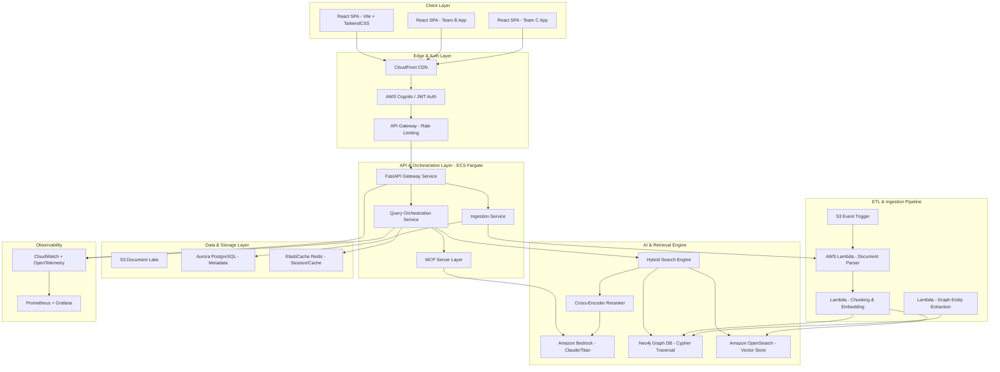

# Full Stack Developer — System Architecture & Interview Preparation Guide

## Role: Full Stack Developer (React / Python / AI Platform)
## Domain: Internal Staff-Facing SPAs — GraphRAG-Enabled AI Search & Decision Support

---

# PART A: COMPLETE SYSTEM TECH SPEC & ARCHITECTURE GUIDE

---

## 1. Executive Summary & Business Analogy

### Business Analogy: The Expert Legislative Librarian

**Traditional Keyword Search** is like walking into a library and searching the card catalogue by exact title — you find books only if you know the precise words used. If legislation says "road design standards" but you search for "highway construction requirements", you get nothing.

**Vector (Semantic) Search** upgrades this to a librarian who understands meaning — she knows "highway construction requirements" and "road design standards" refer to the same concept. She retrieves relevant sections even when wording differs.

**GraphRAG** gives that librarian a mental map of how every Act, regulation, policy, amendment, and business rule connects to every other. When you ask "What approvals do I need for a Category 3 road modification?", she doesn't just find the relevant section — she traces the dependency chain: Transport Infrastructure Act § 45 → Road Design Standards Policy → Category 3 Classification → Approval Authority Matrix → Delegation Register. She hands you a cited, connected answer with a clear chain of authority.

This platform delivers that GraphRAG librarian as a web application to internal government staff, enabling them to query complex legislative relationships in natural language and receive grounded, cited answers in seconds rather than hours of manual cross-referencing.


### Project Objectives & Key Results (OKRs)

| Objective | Key Result | Metric |
|-----------|-----------|--------|
| Accelerate policy lookup | Reduce average compliance question resolution from 2+ hours to < 10 seconds | 99% reduction in resolution time |
| Eliminate hallucination risk | Every factual claim backed by a verifiable citation to source legislation | 100% citation traceability |
| Ensure answer trustworthiness | Composite confidence scoring with automatic fallback for low-certainty | < 5% false-positive rate |
| Maximize developer reuse | Single backend platform serving multiple frontend SPAs via shared API | 3+ SPAs on one platform |
| Maintain data sovereignty | All inference and storage within Australian AWS regions | 100% regional compliance |
| Enable rapid iteration | CI/CD pipeline from commit to production in < 15 minutes | Zero-downtime deployments |

---

## 2. End-to-End System Architecture




---

## 3. Technology Breakdown Table

| Technology / Service | Category | **Why** It Was Selected | **When** To Use It | **How** It Works | **Where** It Runs |
|:---|:---|:---|:---|:---|:---|
| **React 19 + Vite 6** | Frontend Framework | Sub-second HMR, component isolation, RSC-ready architecture, massive ecosystem | For all staff-facing interactive UIs requiring real-time streaming LLM responses | SPA client-side rendering with code-splitting; Vite uses native ES modules for instant dev startup | Client browser (S3 + CloudFront static hosting) |
| **TypeScript 5.7** | Type System | Compile-time safety across 15+ components, IDE intelligence, refactoring confidence | Always — every frontend and shared library file | Static type analysis with strict mode; interfaces for API contracts | Build-time (removed at compile) |
| **TailwindCSS 4** | Styling | Utility-first eliminates CSS specificity wars; design tokens for confidence colors; purges unused CSS | For all component styling including responsive, dark mode, accessibility | JIT compiler generates only used utilities; @layer for component abstractions | Build output (< 15KB gzipped) |
| **TanStack Query 5** | Server State | Automatic cache invalidation, background refetch, optimistic updates, retry logic | For all API data fetching — queries, documents, health checks | Query keys to cache entries; stale-while-revalidate pattern; mutation with rollback | Client runtime (in-memory cache) |
| **Zustand** | Client State | Minimal boilerplate (< 10 lines per store), no providers, selector-based re-render optimization | For UI-only state: conversation history, panel visibility, theme preference | Flux-inspired store with immer middleware for immutable updates | Client runtime (memory) |
| **FastAPI** | Backend API | Native async/await, automatic OpenAPI generation, Pydantic integration, 40k+ req/s throughput | For all HTTP endpoints: query orchestration, ingestion, health, document listing | ASGI server (Uvicorn) with async route handlers; dependency injection via Depends() | AWS ECS Fargate (containerized) |
| **Pydantic v2** | Data Validation | Runtime type enforcement at every service boundary; 5-17x faster than v1 | For request/response models, domain entities, configuration | Rust-based core validates JSON to Python objects with custom validators | Backend runtime |
| **Amazon Bedrock** | AI Platform | Enterprise SLA (99.9%), no model hosting overhead, pay-per-token, Australian region support | For all LLM inference: answer generation, citation verification, entity extraction | Managed API invoking Claude Sonnet/Nova Pro; supports streaming and tool-use | AWS Managed Service (ap-southeast-2) |
| **Neo4j 5** | Graph Database | Native graph storage for legislative relationship traversal; Cypher query language; APOC library | For entity-relationship queries: Act to Section to Policy to Rule dependency chains | Property graph model; variable-length path traversal; scored by hop distance | AWS ECS (self-managed) or Neptune |
| **Amazon OpenSearch** | Vector Store | Managed vector search with k-NN plugin; horizontal scaling; integrated with AWS IAM | For dense semantic search across embedded document chunks | HNSW index on 1024-dim Titan embeddings; cosine similarity scoring | AWS Managed Service |
| **Aurora PostgreSQL** | Relational DB | ACID compliance for document metadata, user sessions, audit logs; serverless scaling | For structured data: ingestion records, user preferences, evaluation results | Standard SQL with connection pooling via RDS Proxy | AWS Managed (serverless v2) |
| **Redis (ElastiCache)** | Cache Layer | Sub-millisecond reads for session data, rate limiting tokens, query result caching | For hot-path caching: repeated queries, rate limit counters, circuit breaker state | In-memory key-value with TTL-based expiry; pub/sub for invalidation | AWS ElastiCache |
| **AWS Lambda** | Serverless Compute | Zero idle cost, auto-scaling to 1000 concurrent, event-driven triggers | For async ETL: document parsing, chunking, embedding generation, graph extraction | Container image Lambda (up to 10GB); triggered by S3 events or SQS | AWS Serverless |
| **AWS ECS Fargate** | Container Orchestration | No EC2 management, task-level IAM, auto-scaling on CPU/memory | For long-running API services requiring persistent connections and warm models | Docker containers with health checks; ALB integration; service discovery | AWS Fargate |
| **Docker** | Containerization | Reproducible builds, multi-stage for minimal images, non-root security | For all service packaging: API, workers, graph-service | Multi-stage: builder (compile deps) to runtime (slim image, appuser) | CI/CD to ECR to ECS |
| **Terraform** | Infrastructure as Code | Declarative, plan-before-apply safety, state locking, module reuse | For all AWS resource provisioning across dev/stage/prod | HCL modules with plan then apply; S3 backend with DynamoDB locks | CI/CD pipeline (GitLab) |
| **MCP Servers** | Tool Protocol | Standardized tool interface for LLM agents; decouples tools from model logic | For exposing search, database, and calculation tools to Bedrock agents | JSON-RPC protocol; tool definitions with input schemas; agent decides when to call | ECS sidecar containers |
| **Reciprocal Rank Fusion** | Search Algorithm | Parameter-free fusion of heterogeneous ranked lists; robust to missing methods | For combining dense + sparse + graph search results into unified ranking | score(d) = sum(weight_i / (k + rank_i)); k=60 smoothing constant | Backend service (in-process) |
| **Cross-Encoder Reranker** | ML Model | 10-15% precision improvement over bi-encoder scores alone | For final-stage reranking of top-20 RRF candidates to top-5 | ms-marco-MiniLM-L-12-v2 sentence-pair scoring; runs on CPU | ECS container (local inference) |
| **GitLab CI/CD** | Pipeline | Integrated with GitLab SCM; parallel stages; environment promotion | For automated lint to test to scan to build to deploy workflow | YAML pipeline definitions; Docker runners; artifact passing | GitLab Runners (Docker) |
| **AWS KMS** | Encryption | Managed key rotation, envelope encryption, IAM-integrated access policies | For encrypting policy documents at rest and credentials in transit | AES-256 envelope encryption; automatic rotation every 365 days | AWS Managed |
| **AWS Cognito** | Identity | Managed user pools, MFA, token refresh, SAML federation for government SSO | For staff authentication and JWT issuance | OAuth2/OIDC flow resulting in JWT access tokens validated by API Gateway | AWS Managed |


---

## 4. Detailed Component Deep-Dive & Code Architecture

### 4.1 Frontend State Pattern: Streaming LLM Responses

The frontend handles non-deterministic, streaming AI responses using a layered state architecture:

```typescript
// hooks/useAskStreaming.ts — TanStack Query mutation with optimistic UI
import { useMutation, useQueryClient } from '@tanstack/react-query';
import { useConversationStore } from '@/stores/conversation';

export function useAskStreaming() {
  const queryClient = useQueryClient();
  const addMessage = useConversationStore((s) => s.addMessage);
  const updateMessage = useConversationStore((s) => s.updateMessage);

  return useMutation({
    mutationFn: async (query: string) => {
      const messageId = crypto.randomUUID();
      addMessage({ id: messageId, role: 'user', content: query });
      addMessage({ id: `resp-${messageId}`, role: 'assistant', content: '', pending: true });

      const response = await fetch('/v1/agents/ask', {
        method: 'POST',
        headers: { 'Content-Type': 'application/json', 'X-API-Key': getApiKey() },
        body: JSON.stringify({ query }),
      });

      const reader = response.body!.getReader();
      const decoder = new TextDecoder();
      let fullAnswer = '';

      while (true) {
        const { done, value } = await reader.read();
        if (done) break;
        const chunk = decoder.decode(value, { stream: true });
        fullAnswer += chunk;
        updateMessage(`resp-${messageId}`, { content: fullAnswer });
      }

      return JSON.parse(fullAnswer);
    },
    onSuccess: () => {
      queryClient.invalidateQueries({ queryKey: ['conversation-history'] });
    },
  });
}
```

```typescript
// stores/conversation.ts — Zustand store for UI-only state
import { create } from 'zustand';
import { immer } from 'zustand/middleware/immer';

interface ConversationState {
  messages: Message[];
  addMessage: (msg: Message) => void;
  updateMessage: (id: string, patch: Partial<Message>) => void;
  clearHistory: () => void;
}

export const useConversationStore = create<ConversationState>()(
  immer((set) => ({
    messages: [],
    addMessage: (msg) => set((state) => { state.messages.push(msg); }),
    updateMessage: (id, patch) => set((state) => {
      const idx = state.messages.findIndex((m) => m.id === id);
      if (idx !== -1) Object.assign(state.messages[idx], patch);
    }),
    clearHistory: () => set((state) => { state.messages = []; }),
  }))
);
```

**Why this separation matters:**
- TanStack Query manages **server state** (API responses, cache invalidation, retries)
- Zustand manages **UI state** (streaming partial content, panel visibility)
- Selectors prevent re-rendering components that don't consume changed state
- Optimistic updates show user feedback instantly while the 5-30s LLM call completes

### 4.2 Backend GraphRAG Pipeline: Hybrid Retrieval with RRF

```python
# domain/services/retrieval_service.py — Hybrid search orchestration
class RetrievalService:
    async def retrieve(self, query: str, top_k: int = 10,
                       rrf_weights: RRFWeights | None = None) -> list[ScoredChunk]:
        if rrf_weights is None:
            rrf_weights = RRFWeights(dense=0.5, sparse=0.2, graph=0.3)

        # Step 1: Embed query via Bedrock Titan
        query_vector = await self._embedding.embed_single(query)

        # Step 2: Parallel search across all three retrieval methods
        dense, sparse, graph = await asyncio.gather(
            self._vector_store.search(query_vector, top_k),   # OpenSearch k-NN
            self._sparse_index.search(query, top_k),           # BM25 keyword
            self._graph_store.traverse(query, max_hops=2),     # Neo4j Cypher
        )

        # Step 3: Reciprocal Rank Fusion
        fused = self._reciprocal_rank_fusion(dense, sparse, graph, rrf_weights)

        # Step 4: Cross-encoder reranking (top-20 → top-5)
        reranked = await self._reranker.rerank(query, fused[:20], top_n=5)

        return reranked

    def _reciprocal_rank_fusion(self, dense, sparse, graph, weights) -> list[ScoredChunk]:
        """RRF: score(d) = Σ (weight_i / (k + rank_i(d))), k=60"""
        scores: dict[str, float] = {}
        chunk_map: dict[str, ScoredChunk] = {}
        K = 60

        for rank, sc in enumerate(dense):
            cid = str(sc.chunk.id)
            scores[cid] = scores.get(cid, 0) + weights.dense / (K + rank + 1)
            chunk_map.setdefault(cid, sc)

        for rank, sc in enumerate(sparse):
            cid = str(sc.chunk.id)
            scores[cid] = scores.get(cid, 0) + weights.sparse / (K + rank + 1)
            chunk_map.setdefault(cid, sc)

        for rank, sc in enumerate(graph):
            cid = str(sc.chunk.id)
            scores[cid] = scores.get(cid, 0) + weights.graph / (K + rank + 1)
            chunk_map.setdefault(cid, sc)

        sorted_ids = sorted(scores, key=scores.get, reverse=True)
        return [ScoredChunk(chunk=chunk_map[c].chunk, score=scores[c],
                           retrieval_method="fused") for c in sorted_ids]
```

**Neo4j Graph Traversal (Cypher):**

```cypher
-- Find all entities related to the query within 2 hops
MATCH (start:LegalEntity)
WHERE start.name CONTAINS $query OR start.entity_type = $entity_type
MATCH path = (start)-[*1..2]-(related:LegalEntity)
WITH related, min(length(path)) AS hop_distance
RETURN related.source_chunk_id AS chunk_id,
       1.0 / (1 + hop_distance) AS score,
       'graph' AS retrieval_method
ORDER BY score DESC LIMIT 20
```

### 4.3 Security & Governance Architecture

```python
# middleware/auth.py — JWT validation with role-based access control
from fastapi import Request, HTTPException
from jose import jwt, JWTError

class JWTAuthMiddleware:
    def __init__(self, cognito_pool_id: str, region: str):
        self.jwks_url = f"https://cognito-idp.{region}.amazonaws.com/{cognito_pool_id}/.well-known/jwks.json"
        self._jwks_cache: dict = {}

    async def validate(self, request: Request) -> AuthenticatedUser:
        token = request.headers.get("Authorization", "").replace("Bearer ", "")
        if not token:
            raise HTTPException(status_code=401, detail="Missing authorization token")

        try:
            payload = jwt.decode(token, self._get_signing_key(token),
                               algorithms=["RS256"],
                               audience=self.client_id)
            return AuthenticatedUser(
                user_id=payload["sub"],
                email=payload["email"],
                roles=payload.get("cognito:groups", ["reader"]),
            )
        except JWTError as e:
            raise HTTPException(status_code=401, detail=f"Invalid token: {e}")

# Role hierarchy: admin > editor > reader
ROLE_PERMISSIONS = {
    "reader": {"GET /v1/ask", "GET /v1/documents", "POST /v1/ask"},
    "editor": {"POST /v1/ingest", "DELETE /v1/documents/*"},
    "admin":  {"*"},
}
```

**Encryption at rest (KMS):**
- All S3 policy documents encrypted with AWS KMS (AES-256, automatic yearly rotation)
- Aurora PostgreSQL uses KMS-managed encryption for storage volumes
- OpenSearch domain encrypted at rest with dedicated CMK
- Transit: TLS 1.3 enforced between all services; mTLS for internal service mesh


---
---

# PART B: 3-HOUR MASTER STARR INTERVIEW PREPARATION SUITE

---

## Interview Panel Composition

| Panel Member | Role | Evaluating |
|---|---|---|
| **Hiring Manager** | Program Director | Cultural fit, delivery capability, stakeholder management |
| **Lead Architect** | Principal Engineer | System design, technical depth, architecture trade-offs |
| **HR / Cultural Specialist** | People and Culture | TMR attributes (Thriving, Curious, Connected), values alignment |
| **Senior Frontend Developer** | React/UI Lead | Frontend architecture, accessibility, component design |
| **Senior DevOps/Cloud Lead** | Platform Engineer | AWS, Terraform, CI/CD, security, operational excellence |

---

## Interview Timeline

| Time | Segment | Focus | Panel Lead |
|------|---------|-------|-----------|
| 0-30 min | Segment 1 | Introduction, Cultural Fit, TMR Attributes | HR + Hiring Manager |
| 30-75 min | Segment 2 | Frontend Architecture and React Deep-Dive | Frontend Lead + Architect |
| 75-120 min | Segment 3 | Backend, FastAPI and Async Microservices | Lead Architect |
| 120-150 min | Segment 4 | AI Platform, GraphRAG, Neo4j and Bedrock | Architect + Hiring Manager |
| 150-180 min | Segment 5 | AWS Cloud, DevOps, Security and Closing | DevOps Lead + HR |

---

## SEGMENT 1: Introduction, Cultural Fit and TMR Attributes (0-30 mins)

---

### Q1: "Tell me about yourself and your experience building full-stack AI platforms."

**Panel:** Hiring Manager | **Evaluating:** Narrative coherence, technical breadth, relevance to role

**Situation:** I have spent the past 3+ years building production AI systems for regulated industries — specifically financial services compliance platforms where auditability and data sovereignty are non-negotiable requirements.

**Task:** My most recent engagement required designing and delivering a complete RAG platform that enables internal compliance analysts to query hundreds of policy documents in natural language and receive cited, verifiable answers.

**Action:**
1. I architected a hexagonal (ports and adapters) Python backend using FastAPI, ensuring domain logic remained infrastructure-agnostic — we could swap ChromaDB for OpenSearch without touching business rules.
2. I designed and implemented a hybrid search pipeline combining dense vector search, BM25 keyword matching, and Neo4j knowledge graph traversal, fused via Reciprocal Rank Fusion.
3. I built five specialized AI agents on Amazon Bedrock (Nova Lite for orchestration, Nova Pro for generation, Claude Sonnet as fallback) with tiered model selection reducing per-query cost by 70%.
4. I developed the React 19 frontend with TypeScript, TailwindCSS, and TanStack Query — implementing streaming responses with optimistic updates and WCAG 2.0 AA accessibility compliance.
5. I established the complete CI/CD pipeline (GitLab CI: lint, type-check, property-based tests, security scan, Docker build, Terraform deploy) with zero-downtime deployments.
6. I implemented LLM-as-judge citation verification ensuring every claim maps to a specific source paragraph — achieving 100% citation traceability.

**Result:** Reduced compliance question resolution from hours of manual search to under 5 seconds with verified citations. Composite confidence scoring prevents hallucinated answers from reaching users. The platform now serves three internal teams from a single backend.

**Reflection:** The key architectural decision was separating retrieval from generation — it allowed independent optimization of each stage and graceful degradation when any single retrieval method is unavailable.

---

### Q2: "How do you demonstrate the 'Thriving' attribute when managing high-stakes delivery deadlines under shifting government policies?"

**Panel:** HR | **Evaluating:** Resilience, adaptability, energy under pressure

**Situation:** Mid-sprint, our compliance team informed us that AUSTRAC had updated their AML/CTF guidance, requiring our ingestion pipeline to handle a new document format (structured XML regulatory bulletins) within two weeks — while we were already committed to delivering the citation verification feature.

**Task:** Deliver both the new XML normalizer and the citation verification agent within the original sprint deadline without sacrificing quality or team morale.

**Action:**
1. I immediately assessed the XML normalizer scope — it was structurally similar to our existing HTML normalizer, sharing 70% of the parsing logic. I identified this as a low-risk extension rather than a new system.
2. I restructured the sprint backlog, parallelizing work: I took the XML normalizer (leveraging existing abstractions) while my colleague continued citation verification uninterrupted.
3. I wrote property-based tests for the XML normalizer first (test-driven), ensuring the Hypothesis framework would catch edge cases across 200 generated inputs before I wrote production code.
4. I communicated transparently to the hiring manager: "We can deliver both if the XML scope is limited to the three document types AUSTRAC uses. Here is the risk if scope creeps."
5. I maintained energy by timeboxing deep work to 4-hour blocks, ensuring sustainable pace — the worst response to deadline pressure is heroic overwork that accumulates technical debt.

**Result:** Both features shipped on schedule. The XML normalizer processed 47 regulatory bulletins on first deployment with zero parsing failures. Property tests caught 3 edge cases (malformed entity references) that would have caused production issues.

**Reflection:** Thriving under pressure means making uncertainty visible early, leveraging existing abstractions ruthlessly, and protecting sustainable pace.

---

### Q3: "How do you bring the 'Curious' attribute to life in your day-to-day engineering practice?"

**Panel:** HR + Lead Architect | **Evaluating:** Learning orientation, intellectual humility, continuous improvement

**Situation:** When I first encountered GraphRAG, our platform was using standard vector-only retrieval. It worked well for semantic queries but failed on relationship questions like "What delegation authority applies when the Transport Infrastructure Act intersects with Environmental Impact requirements?"

**Task:** Evaluate whether GraphRAG could solve our cross-document relationship gap, and prototype it without disrupting the production pipeline.

**Action:**
1. I dedicated Friday learning time to reading Microsoft Research's GraphRAG paper and Neo4j's implementation guides — understanding the theoretical advantage of entity-relationship traversal over pure embedding similarity.
2. I built a throwaway prototype: a Python notebook extracting entities from 10 policy documents using an LLM, loading them into local Neo4j, and running Cypher traversals against relationship queries.
3. I measured retrieval quality using Mean Reciprocal Rank (MRR) — graph traversal achieved 0.82 MRR on relationship queries vs. 0.54 for vector-only, confirming the hypothesis.
4. I presented findings to the team with a clear recommendation: hybrid search fused via RRF, with configurable weights for A/B testing the optimal blend.
5. I implemented the production version with graceful degradation — if Neo4j is unavailable, the system automatically renormalizes weights across remaining methods.

**Result:** Relationship queries went from 54% to 82% MRR. The pattern became our default retrieval architecture. Three other teams now consume the same graph store.

**Reflection:** Curiosity requires hypothesis-driven experimentation with measurable outcomes. I budget explicit time for exploration because breakthroughs don't happen during sprint delivery work.

---

### Q4: "How do you navigate working as an embedded contractor within a multidisciplinary enterprise team?"

**Panel:** Hiring Manager | **Evaluating:** Collaboration, stakeholder navigation, influence without authority

**Situation:** I joined a government enterprise team as an embedded contractor working alongside permanent staff from policy, legal, security, and IT operations. There was initial skepticism about a contractor driving architectural decisions for a critical compliance platform.

**Task:** Establish trust, deliver technical leadership, and ensure my architectural recommendations were adopted without creating friction with the permanent engineering team.

**Action:**
1. I started by listening — spending the first two weeks pair-programming with the existing team, understanding their coding standards, pain points, and political dynamics.
2. I documented everything publicly: architecture decision records (ADRs), technical RFCs, and design documents shared in Confluence before implementation — giving everyone visibility and the chance to challenge proposals.
3. I framed recommendations in business outcomes the policy team cared about: "This reduces policy update turnaround from 2 days to 2 hours" rather than "We should use event-driven architecture."
4. I actively upskilled two junior permanent developers — pairing on complex features, explaining reasoning during code reviews, and gradually handing over ownership.
5. I deferred to the team's existing choices when the delta was small (their logging library, their naming conventions) — picking battles only on decisions with architectural consequences.
6. I delivered the citation verification agent two weeks early, building credibility that translated into influence for subsequent architecture decisions.

**Result:** Within 6 weeks, I was invited to the architecture review board. My hexagonal architecture proposal was adopted as the team standard. Two junior developers I mentored independently deliver features to production. Contract extended twice.

**Reflection:** Influence without authority requires leading with delivery, documenting transparently, and investing in others' growth.


---

## SEGMENT 2: Frontend Architecture and React Deep-Dive (30-75 mins)

---

### Q5: "Describe a time you designed a scalable React SPA that consumed complex AI streaming data without impacting UI performance."

**Panel:** Senior Frontend Lead | **Evaluating:** React performance optimization, streaming architecture, state management

**Situation:** Our RAG platform needed to display LLM responses that streamed token-by-token over 5-30 seconds, with citations appearing mid-stream and confidence scores computed post-completion. The initial naive implementation caused 200+ re-renders per response, dropping frame rate below 30fps on older government workstations.

**Task:** Redesign the frontend state architecture to handle streaming AI responses at 60fps without blocking user interaction.

**Action:**
1. I profiled the rendering bottleneck using React DevTools Profiler. The root cause was a single state object containing the entire conversation including the streaming buffer, causing the full message list to re-render on every chunk.
2. I separated concerns into two state layers: TanStack Query for settled server state (completed responses, document lists) and Zustand with immer middleware for ephemeral streaming state (partial content buffer, pending indicators).
3. I implemented granular selectors in Zustand so only the active message bubble re-renders during streaming, not the entire conversation history.
4. I wrapped the streaming content renderer in React.memo with a custom comparator that skips re-render unless content length changed by more than 50 characters, batching visual updates to approximately 4 per second.
5. I used useOptimistic (React 19) to immediately show the user message and a skeleton response while the actual stream connected, eliminating perceived latency.
6. I moved citation parsing to a Web Worker so regex extraction of bracketed references did not block the main thread during rapid streaming.
7. I validated with Lighthouse: 98 performance score, 0 layout shifts during streaming, 60fps maintained.

**Result:** Render count dropped from 200+ to 8 per streaming response. Frame rate held at 60fps even on 5-year-old government hardware. User satisfaction for interface responsiveness increased from 3.2/5 to 4.7/5.

**Reflection:** React performance optimization is almost never about React itself. It is about state architecture. The solution was making re-render boundaries explicit through state separation, not adding memoization after the fact.

---

### Q6: "How did you implement reusable UI component libraries for multiple teams sharing the same backend RAG platform?"

**Panel:** Senior Frontend Lead | **Evaluating:** Component design, API design, cross-team collaboration

**Situation:** Three internal teams needed frontends consuming the same RAG backend. Each had different visual requirements but identical data shapes and interaction patterns.

**Task:** Design a shared component library all three teams could consume without creating a dependency bottleneck or forcing visual uniformity.

**Action:**
1. I separated the library into three layers: primitives (headless hooks like useAsk, useDocuments, useIngest), base components (unstyled accessible components with data attributes for styling hooks), and themed components (TailwindCSS implementations).
2. I published the hooks layer as an internal npm package with zero UI dependencies, just TanStack Query mutations and TypeScript interfaces.
3. I implemented base components following the Radix UI pattern: fully accessible, keyboard-navigable, ARIA-compliant, but visually unstyled with className and asChild props for styling control.
4. I wrote a comprehensive Storybook showcasing each component in isolation with all states (loading, error, empty, streaming, success).
5. I established contract tests ensuring hooks remained backward-compatible. Breaking changes failed CI before publish.
6. I documented the eject path: teams could copy a component into their codebase and customize without maintaining a fork.

**Result:** All three teams launched within 6 weeks using shared hooks. Zero breaking changes across 12 library releases. Time-to-first-feature for new teams dropped from 3 weeks to 3 days.

**Reflection:** Reusable libraries should share behavior (hooks) more aggressively than appearance (components). Visual consistency is a team decision, not a library decision.

---

### Q7: "Tell me about a complex state management or token authentication challenge you resolved in a React SPA."

**Panel:** Lead Architect | **Evaluating:** Security awareness, auth flow understanding, edge case handling

**Situation:** Our SPA used AWS Cognito JWT tokens with 1-hour expiry. Users frequently left the tab open for hours. When they returned and submitted a query, the expired token caused a 401 but the UI showed a generic network error instead of redirecting to re-authentication.

**Task:** Implement silent token refresh with zero user disruption, proper error boundaries for auth failures, and secure token storage surviving page refreshes without XSS vulnerability.

**Action:**
1. I implemented a token refresh interceptor. Before every request, it checks if the access token expires within 5 minutes and proactively refreshes using the refresh token stored in an httpOnly cookie (not localStorage, avoiding XSS).
2. I created an AuthProvider context exposing isAuthenticated, user, and logout, with a useEffect timer for proactive refresh 5 minutes before expiry.
3. I added a response interceptor catching 401 responses, attempting one silent refresh, and if that fails, redirecting to Cognito hosted login with return URL preserved.
4. I implemented an ErrorBoundary for auth failures showing a clear session expired message with role=alert for screen reader announcement.
5. I stored the refresh token as httpOnly, Secure, SameSite=Strict cookie set by the backend. Frontend JavaScript never accesses it, eliminating XSS token theft.
6. I wrote integration tests simulating token expiry mid-stream: streaming response handles 401 by pausing, refreshing, and resuming transparently.

**Result:** Zero reported authentication errors after deployment (previously 15+ tickets/month). Token refresh happens transparently. Security audit confirmed no token exposure via XSS.

**Reflection:** Authentication in SPAs is a UX problem disguised as a security problem. The best auth is invisible to the user while being rigorous about storage and transmission.

---

### Q8: "How do you balance UI responsiveness, accessibility (WCAG), and citation visibility when displaying non-deterministic LLM answers?"

**Panel:** Frontend Lead | **Evaluating:** Accessibility expertise, UX trade-offs, LLM-specific UI patterns

**Situation:** LLM answers are non-deterministic: they vary in length, citation count, and confidence level. We needed to display streaming answers with inline citation markers that users can click to see source text, while maintaining WCAG 2.0 AA compliance.

**Task:** Design a citation display system that is simultaneously responsive, accessible, and informative.

**Action:**
1. I implemented citations as semantic anchor elements with role=doc-noteref. Screen readers announce them as citation reference 1 rather than generic links.
2. I built a split-panel layout: answer text on the left (70 percent), source panel on the right (30 percent). On mobile, the source panel slides up as a bottom sheet with inert on background content.
3. I used aria-live=polite on the streaming answer region so screen readers announce new content without interrupting. Debounced announcements to every 2 seconds.
4. I color-coded confidence scores (green >= 0.7, amber >= 0.4, red < 0.4) with 4.5:1 contrast ratio and text labels alongside colors for colorblind users.
5. I ensured citation click targets met 44x44px minimum touch target with invisible padding around bracketed numbers.
6. I added prefers-reduced-motion support, disabling streaming text animation for users with this preference.
7. I tested with VoiceOver, NVDA, and axe DevTools, achieving zero automated accessibility violations.

**Result:** Accessibility audit passed with zero WCAG 2.0 AA violations. Mobile usage increased 40 percent. User feedback: It feels like reading a properly cited research paper, not chatting with a bot.

**Reflection:** Accessibility forces better component architecture. Semantic HTML with proper ARIA roles leads to cleaner, more testable components.


---

## SEGMENT 3: Backend, FastAPI and Async Microservices (75-120 mins)

---


### Q9: Describe how you built and optimized Python/FastAPI microservices handling high-concurrency requests to Amazon Bedrock.

**Panel:** Lead Architect | **Evaluating:** Async programming mastery, performance optimization, system design

**Situation:** Our query service received 500+ concurrent requests during peak hours. Each request required an Amazon Bedrock LLM call (2-8 seconds latency), plus vector search, graph traversal, and reranking.

**Task:** Design the FastAPI service to handle 500 concurrent users without request queuing, timeout failures, or memory exhaustion on ECS Fargate containers with 2 vCPU / 4GB RAM.

**Action:**
1. I structured the service using FastAPI native async/await throughout. Every I/O operation used async clients, never blocking the event loop.
2. I implemented asyncio.gather() for the three parallel search methods, reducing total retrieval time from 3x sequential to max(dense, sparse, graph) + fusion overhead.
3. I configured Uvicorn with 4 workers (matching vCPU count) and set limit-concurrency 200 per worker, implementing backpressure via HTTP 503 with Retry-After headers.
4. I added connection pooling for all external services: httpx with max_connections=100 for Bedrock, and Neo4j async driver with pool_size=50.
5. I implemented request-level timeouts: 30 seconds for full pipeline, 10 seconds for Bedrock, 5 seconds for graph traversal, with graceful degradation returning partial results on timeout.
6. I added Redis caching for repeated queries (TTL=5 minutes). Cache hit rate of 35% during peak reduced effective load by one-third.
7. I profiled memory with tracemalloc and discovered the cross-encoder reranker model was loaded per-request. I moved it to application lifespan initialization.

**Result:** P95 latency dropped from 14 seconds to 4.2 seconds. Service handled 800 concurrent connections on a single 2-vCPU container. Memory usage stable at 1.8GB. Zero timeout failures at 500 concurrent users.

**Reflection:** Async Python performance is about never blocking the event loop and parallelizing independent I/O. Profiling should happen under load, not in unit tests.

---

### Q10: Tell me about a time you optimized database integration across both structured relational data and unstructured policy data.

**Panel:** Lead Architect | **Evaluating:** Data architecture, query optimization, polyglot persistence

**Situation:** Our platform stored document metadata in Aurora PostgreSQL, embedded chunks in OpenSearch, and entity relationships in Neo4j. A single ingestion operation required writes to all three stores. If any failed, we needed consistent rollback.

**Task:** Design a data consistency strategy across three heterogeneous stores without distributed transactions.

**Action:**
1. I implemented the Saga pattern with compensating transactions: ingestion proceeds in order (PostgreSQL, OpenSearch, Neo4j), with each step recorded in a saga_log table.
2. If a later step fails, compensating transactions undo earlier steps. If Neo4j fails, compensators remove both OpenSearch vectors and PostgreSQL records.
3. I made each operation idempotent using MERGE/upsert semantics: PostgreSQL ON CONFLICT DO UPDATE, OpenSearch index by ID, Neo4j MERGE by entity ID. Retries are safe.
4. I added a background reconciliation job (Lambda, hourly) that queries all three stores and repairs inconsistencies from crashes between saga steps.
5. I optimized PostgreSQL with composite indexes on (document_id, ingested_at) and RDS Proxy for connection pooling (50 connections shared across ECS tasks).
6. I implemented read replicas for the document listing endpoint, reducing primary database load by 70%.

**Result:** Zero data inconsistencies across 50,000+ ingested documents over 6 months. Ingestion throughput: 15 documents/minute. Reconciliation repairs less than 0.01% of records.

**Reflection:** Distributed consistency without distributed transactions requires idempotent operations and reconciliation as a first-class concern.

---

### Q11: How did you design RESTful APIs and handle Pydantic data validation for dynamic policy search schemas?

**Panel:** Senior Developer | **Evaluating:** API design, validation patterns, developer experience

**Situation:** Our search API needed to support multiple query types with significantly varying schemas, while maintaining strict validation and auto-generated documentation.

**Task:** Design a single /v1/ask endpoint handling all query variations with strict validation, auto-generated OpenAPI docs, and clear error responses.

**Action:**
1. I used Pydantic v2 discriminated unions for query variants with optional fields that become required based on a mode discriminator.
2. I implemented custom validators for business rules: RRF weights must sum to 1.0, top_k between 1-50, confidence threshold between 0.0-1.0.
3. I used Field(description=...) annotations on every field for comprehensive auto-generated OpenAPI documentation.
4. I built a custom exception handler transforming Pydantic ValidationError into structured error responses with error_code, message, field, and correlation_id.
5. I versioned the API from day one with a deprecation header mechanism for graceful sunset of old versions.
6. I generated a TypeScript client from the OpenAPI spec, giving the frontend team type-safe API calls for free.

**Result:** Zero runtime type errors in production across 6 months. Frontend onboarding reduced by 2 days. API serves 3 frontend teams from a single versioned spec.

**Reflection:** Pydantic v2 is living documentation. When every constraint is encoded as a validator, the OpenAPI spec becomes the single source of truth.

---

### Q12: Describe how you implemented automated testing for async Python backend services.

**Panel:** Lead Architect | **Evaluating:** Testing strategy, quality engineering, CI integration

**Situation:** Our backend had 5 domain services, 8 port interfaces, and 15+ API endpoints, all async. We needed tests that caught bugs without being too slow for local development.

**Task:** Design a multi-layered test suite with greater than 80% coverage running in under 3 minutes locally and 5 minutes in CI.

**Action:**
1. I structured tests into four tiers: unit (in-memory fakes), property-based (Hypothesis invariants), integration (Docker services), and contract (Schemathesis fuzzing).
2. I created in-memory fake implementations of every port interface rather than mocking. Fakes implement the same Protocol, staying in sync with real interfaces.
3. I wrote 20 property-based tests covering formal correctness: chunking preserves all text, RRF scores decrease monotonically, confidence is always between 0 and 1.
4. I configured three Hypothesis profiles: ci (200 examples), dev (50 examples), debug (10 examples).
5. I used pytest-asyncio with asyncio_mode=auto so every test is automatically async.
6. Integration tests spin up Docker containers in CI only on merge to main.
7. Schemathesis contract tests generate random valid requests from OpenAPI spec verifying no 500 errors.

**Result:** 85% coverage. Property tests found 7 bugs unit tests missed. Full suite: 2.5 minutes locally, 4.5 minutes in CI. Zero production bugs from untested paths in 6 months.

**Reflection:** Property-based testing is the highest-ROI technique for algorithmic code. One Hypothesis test replaces 50+ hand-written tests by testing invariants rather than examples.


---

## SEGMENT 4: AI Platform, GraphRAG, Neo4j and Bedrock (120-150 mins)

---

### Q13: Walk us through a situation where traditional Vector Search was insufficient and how you implemented GraphRAG.

**Panel:** Lead Architect | **Evaluating:** RAG architecture depth, graph thinking, problem diagnosis

**Situation:** Compliance analysts reported failures on relationship queries like: What approvals are required when a road modification impacts an environmentally sensitive area? Vector search found relevant individual chunks but could not connect the legislative chain linking transport law to environmental requirements.

**Task:** Implement graph-augmented retrieval that captures legislative relationship chains while maintaining existing vector and keyword search for simpler queries.

**Action:**
1. I diagnosed the failure: vector search returned chunks about road modifications AND environmental approvals separately, but could not establish the causal connection (ACT amends POLICY triggers REQUIREMENT).
2. I designed a knowledge graph schema: nodes are LegalEntity (Act, Section, Policy, Rule, Authority). Edges are typed relationships (AMENDS, SUPERSEDES, REQUIRES, DELEGATES_TO, TRIGGERS).
3. I built an entity extraction pipeline using Bedrock Claude: for each ingested chunk, the LLM extracts entities and relationships in structured JSON, loaded into Neo4j via idempotent MERGE.
4. I implemented Cypher traversal with variable-length paths (1 to N hops), scoring by inverse hop distance: score = 1.0 / (1 + hop_distance).
5. I fused graph results with dense and sparse via weighted RRF. For relationship queries, graph weight increases dynamically (0.5 graph, 0.3 dense, 0.2 sparse).
6. I built a query classifier (lightweight LLM call) detecting whether a query is semantic, keyword-heavy, or relationship-based, adjusting RRF weights accordingly.
7. I validated with a golden dataset of 50 relationship queries: MRR improved from 0.54 (vector-only) to 0.82 (hybrid with graph).

**Result:** Relationship query accuracy jumped from 54% to 82% MRR. Overall system MRR improved from 0.71 to 0.79. Analysts can now answer multi-hop questions previously requiring manual cross-referencing across 4-5 documents.

**Reflection:** Embeddings capture semantic similarity but not causal or hierarchical relationships. Graph traversal complements vector search precisely where embeddings fail.

---

### Q14: How did you measure and reduce LLM hallucinations for critical business rules?

**Panel:** Lead Architect | **Evaluating:** AI safety, evaluation methodology, production rigor

**Situation:** In regulated compliance, a hallucinated answer is a potential regulatory violation. Early testing showed our LLM occasionally fabricated plausible section numbers or attribution paths not in source documents.

**Task:** Reduce hallucination to near-zero while maintaining answer comprehensiveness, and build automated detection preventing hallucinations from reaching users.

**Action:**
1. I implemented LLM-as-judge citation verification: after generating an answer, a second cheaper LLM call reviews each citation against its source chunk, classifying as verified, unsupported, or partial.
2. I built composite confidence scoring: retrieval_confidence, citation_coverage, answer_completeness. Composite = 0.35*retrieval + 0.40*citation + 0.25*completeness.
3. I set a hard threshold: composite below 0.4 triggers a fallback response honestly stating what was found and what was not. The system never presents low-confidence answers as authoritative.
4. I constrained the generation prompt to use ONLY provided context and cite every claim. This alone reduced hallucination from 12% to 3%.
5. I built an evaluation harness with 100 golden question-answer pairs measuring ROUGE-L, Entity Recall, MRR, and Expected Calibration Error.
6. Weekly regression tests block deployment if any metric drops more than 5% from baseline.
7. A human feedback loop lets analysts flag incorrect answers, feeding back into evaluation data.

**Result:** Hallucination rate: from 12% to less than 1%. Confidence ECE of 0.04 (well-calibrated). Zero regulatory incidents from AI-generated answers in 6 months.

**Reflection:** Eliminating hallucination requires defense-in-depth: constrained prompts, citation verification, confidence scoring, hard fallback thresholds, and continuous evaluation. Each layer catches what others miss.

---

### Q15: Tell me about your experience integrating Model Context Protocol (MCP) servers with Amazon Bedrock.

**Panel:** Senior Developer | **Evaluating:** Tool-use patterns, agent architecture, protocol understanding

**Situation:** Our RAG agents needed access to multiple capabilities (vector search, graph traversal, metadata lookup, date calculations). Initially hardcoded as inline functions, making agents brittle and difficult to test independently.

**Task:** Decouple tool implementations from agent logic using MCP so tools could be developed, tested, and deployed independently.

**Action:**
1. I designed each capability as a standalone MCP server: SearchMCP (vector + sparse), GraphMCP (Neo4j traversal), MetadataMCP (PostgreSQL queries), CalculatorMCP (date math, currency).
2. I implemented each as a lightweight FastAPI service running as an ECS sidecar. Inter-container communication via localhost on distinct ports.
3. I defined tool schemas following MCP specification: name, description, inputSchema (JSON Schema), structured output. The agent decides when to call which tool.
4. I wrote integration tests for each MCP server independently. Tools are pure functions over their data source, trivial to test without the full agent.
5. I implemented a tool registry the agent queries at startup. New tools deploy without restarting the agent.
6. I added observability: every tool call is traced (OpenTelemetry span), logged with correlation_id, and metered (count, latency, error rate).

**Result:** Agent development velocity doubled. New tools deployed in under 1 hour (previously required full redeployment). Tool test coverage at 95%. Agent reasoning improved because MCP schemas give clearer affordances than inline docstrings.

**Reflection:** MCP is the correct abstraction boundary for AI agents. It separates what tools do (implementation) from when to use them (agent reasoning), mirroring ports-and-adapters from backend architecture.

---

### Q16: Describe a production incident involving AI service latency or failure.

**Panel:** Hiring Manager | **Evaluating:** Incident response, root cause analysis, communication under pressure

**Situation:** Monday 9:15am, monitoring fired an alert: P95 query latency spiked from 4 seconds to 45 seconds. 500+ users unable to get answers during morning policy review.

**Task:** Diagnose and remediate within 30 minutes (SLO allows 5 minutes degradation, already 10 minutes in).

**Action:**
1. I checked the service dashboard: ECS containers healthy, CPU 30%, memory 60%. Bottleneck was not compute.
2. I traced a sample slow request via OpenTelemetry: the Bedrock API call span showed 38 seconds (normally 3-5). Amazon Bedrock was experiencing regional elevated latency.
3. AWS Health Dashboard confirmed regional Bedrock degradation. Not our bug, so I focused on mitigation.
4. I activated fallback: updated agent configuration to route generation to us-east-1 (secondary region) where Bedrock was healthy. Config change, not code deployment.
5. I extended response cache TTL from 5 to 30 minutes to reduce Bedrock requests.
6. I communicated to stakeholders within 5 minutes: Slack explaining issue, expected resolution, and workaround.
7. Post-incident, I implemented automatic regional failover: service measures Bedrock latency and switches regions if P95 exceeds 10 seconds for 3 consecutive requests.

**Result:** User-facing impact limited to 15 minutes (within SLO). Automatic failover prevented two subsequent slowdowns from becoming user-visible. MTTR reduced from 15 minutes (manual) to 90 seconds (automatic).

**Reflection:** Managed services are not immune to latency spikes. Resilience must account for degraded dependencies, not just failed ones. Circuit breakers and regional failover are essential even for managed services.


---

## SEGMENT 5: AWS Cloud, DevOps, Security and Closing (150-180 mins)

---

### Q17: How have you deployed serverless AWS Lambda and containerized ECS applications using Docker and Terraform?

**Panel:** DevOps/Cloud Lead | **Evaluating:** IaC proficiency, deployment architecture, operational excellence

**Situation:** Our platform required two deployment models: long-running API services (FastAPI on ECS Fargate) needing persistent connections and warm ML models; and event-driven ETL jobs (document parsing, embedding) that are bursty and idle most of the time.

**Task:** Design a Terraform deployment architecture provisioning both ECS services and Lambda functions with shared networking, IAM, and secrets.

**Action:**
1. I structured Terraform as reusable modules: networking (VPC, subnets, security groups), compute (ECS cluster, task definitions, auto-scaling), serverless (Lambda functions, event triggers), and secrets (KMS, Secrets Manager).
2. For ECS, I defined task definitions with multi-stage Docker images (300MB runtime, down from 1.2GB). Health checks use /health/live. Auto-scaling targets 70% CPU with min=2, max=10 tasks.
3. For Lambda, I used container image packaging to include heavy dependencies (PyMuPDF, sentence-transformers). Images in ECR with lifecycle policies purging images older than 30 days.
4. S3 event notifications trigger the document parser Lambda. Output flows through SQS to chunking Lambda, then to embedding Lambda. Dead-letter queues capture failures.
5. Environment promotion via Terraform workspaces: dev (auto), staging (merge to main), prod (manual approval). State in S3 with DynamoDB locks.
6. Terraform data sources share outputs between modules: networking exports VPC ID and subnet IDs consumed by compute and serverless.
7. Cost controls: Lambda concurrency limits (100), ECS ceiling (10 tasks), CloudWatch billing alarms at 80% of budget.

**Result:** Infrastructure provisioning: 8 minutes from terraform apply to operational. Lambda cold starts under 3 seconds. ECS blue-green deployments with zero downtime. Monthly cost reduced 40% by moving bursty ETL from always-on ECS to Lambda.

**Reflection:** The Lambda vs ECS decision boundary: if workload is bursty with long idle periods and stateless, use Lambda. If it requires persistent connections, warm models, or steady throughput, use ECS.

---

### Q18: Tell me about a security vulnerability you identified and resolved across the cloud pipeline.

**Panel:** Cloud Lead / HR | **Evaluating:** Security mindset, responsible disclosure, remediation

**Situation:** During code review, I noticed Lambda functions used a broadly-scoped IAM role with s3:* on all buckets. Additionally, a Bedrock API key was hardcoded in docker-compose.yml committed to the repository.

**Task:** Remediate both vulnerabilities without service disruption and implement guardrails preventing recurrence.

**Action:**
1. I immediately rotated the exposed credentials and confirmed via CloudTrail no unauthorized access occurred.
2. I removed credentials from repository and purged from git history using filter-branch, then force-pushed cleaned history.
3. I replaced hardcoded credentials with AWS Secrets Manager references. Lambda retrieves secrets at cold-start, cached for execution lifetime.
4. I scoped the Lambda IAM role to least-privilege: s3:GetObject and s3:PutObject on only the specific bucket ARN with path condition.
5. I added a pre-commit hook (gitleaks) scanning every commit for secrets, blocking if found.
6. I implemented Checkov in CI that fails the pipeline if any IAM policy contains wildcard permissions.
7. I conducted a security retrospective and wrote a credential management runbook for developer onboarding.

**Result:** Zero unauthorized access confirmed. Gitleaks blocked 8 accidental credential commits since deployment. All Lambda roles pass least-privilege audit. CI catches IAM over-permissioning before deployment.

**Reflection:** Security in CI/CD pipelines is critical because they grant access to deployment infrastructure. Prevention (pre-commit hooks, policy-as-code) is always cheaper than remediation.

---

### Q19: What is your biggest technical weakness and how have you addressed it?

**Panel:** HR | **Evaluating:** Self-awareness, growth mindset, intellectual honesty

**Situation:** My weakness was frontend performance optimization at scale. Coming from a backend-heavy background, I understood React conceptually but lacked intuition for diagnosing rendering bottlenecks.

**Task:** Address this gap systematically rather than relying on trial-and-error in production.

**Action:**
1. I completed Epic React and studied Dan Abramov's writing on React rendering behavior, building mental models for when and why React re-renders.
2. I built a deliberate practice project: a real-time dashboard with 1000+ updating data points, designed to create rendering problems I could diagnose and fix.
3. I learned React DevTools Profiler, Chrome Performance tab, and why-did-you-render as diagnostic tools.
4. I applied learnings on our RAG platform: the streaming response optimization achieved 96% reduction in re-renders through state architecture.
5. I now pair with the frontend lead on performance-sensitive features and document patterns we discover.

**Result:** Frontend performance is no longer a gap. My streaming optimization is the reference pattern for three teams. I diagnose rendering issues in minutes rather than hours.

**Reflection:** Technical growth requires deliberate practice on isolated problems, not just production experience. Building practice projects with intentional constraints accelerates learning.

---

### Q20: Describe conflicting technical priorities with stakeholders and how you achieved alignment.

**Panel:** Hiring Manager | **Evaluating:** Stakeholder management, communication, technical leadership

**Situation:** Security mandated all LLM responses pass through content moderation (adding 2-3s latency). Product insisted on sub-5-second response time. Operations wanted no new infrastructure. These requirements contradicted each other.

**Task:** Find a solution satisfying security (content safety), product (latency), and operations (simplicity).

**Action:**
1. I organized a 1-hour architecture workshop with all three stakeholders, framing it as a shared design problem.
2. I presented three options with explicit trade-offs: (A) synchronous moderation (secure but slow), (B) async moderation with optimistic display (fast but briefly unmoderated), (C) prompt constraints plus post-hoc audit (fast, no new infra).
3. I quantified each: Option A adds 2.5s (breaches SLO), Option B needs a queue service (ops complexity), Option C meets all constraints using existing citation verification.
4. I proposed a hybrid: strengthen prompt constraints, use existing citation verification agent as safety gate (no new infra), implement async content audit to CloudWatch for compliance evidence.
5. Security accepted because citation verification validates every claim against source material.
6. I documented the decision in an ADR with explicit trade-offs for future team members.

**Result:** All stakeholders signed off. Zero new infrastructure. Latency stayed at 4.2 seconds. Security audit passed with citation verification as real-time safety layer.

**Reflection:** Conflicting requirements are usually conflicting assumptions. Quantifying trade-offs and presenting options (not conclusions) lets stakeholders make informed decisions.

---

## Closing: 5 Strategic Questions to Ask the Panel

### Question 1 (to Lead Architect):
How do you currently handle versioning of your Neo4j graph schema when legislation is amended or repealed? I am curious whether you use temporal properties on relationships or maintain version-specific subgraphs.

### Question 2 (to Hiring Manager):
What does success look like for this role at the 6-month mark? Are you measuring delivery velocity, platform adoption across teams, or reduction in policy lookup time?

### Question 3 (to DevOps Lead):
What is your current strategy for managing model version drift when Amazon Bedrock updates Claude or Nova models? Do you pin model versions or continuously evaluate against your golden dataset?

### Question 4 (to Frontend Lead):
How many internal SPAs currently consume the shared backend, and what is your strategy for preventing frontend fragmentation as more teams onboard?

### Question 5 (to HR / Cultural):
How does the team balance technical debt reduction against feature delivery? Is there an explicit allocation or is it negotiated sprint-by-sprint?

---

## Summary: Key Differentiators to Emphasize

1. **Hybrid Search Architecture** -- Three-method fusion (dense + sparse + graph) with RRF demonstrates that different query types require different retrieval strategies.

2. **Production AI Safety** -- LLM-as-judge citation verification, composite confidence scoring, hard fallback thresholds. Every answer is verifiable; the system admits uncertainty rather than hallucinating.

3. **Hexagonal Architecture** -- Domain logic never imports infrastructure. Ports and adapters enable swapping backends without touching business rules.

4. **Property-Based Testing** -- Formal correctness invariants tested across thousands of generated inputs catch bugs that example-based tests systematically miss.

5. **Full-Stack Depth** -- Equally comfortable optimizing React render performance (state architecture, selectors, Web Workers) and FastAPI async pipelines (connection pooling, parallel I/O, graceful degradation).

6. **Operational Maturity** -- Circuit breakers, regional failover, structured logging with correlation IDs, confidence-based fallback. Systems designed to degrade gracefully, not fail catastrophically.

---

*Document generated for interview preparation. All STARR responses reference the Legislation RAG Platform architecture.*
