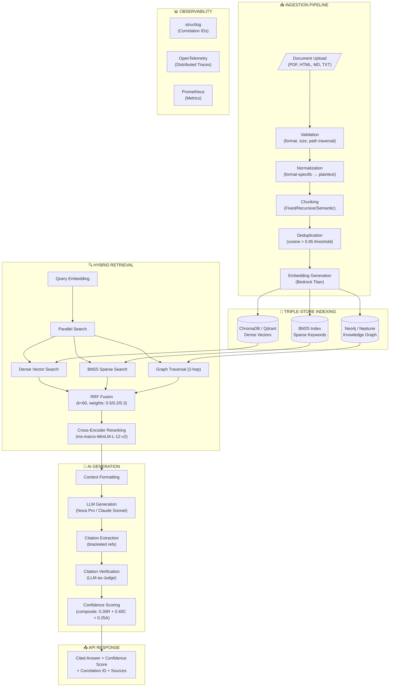
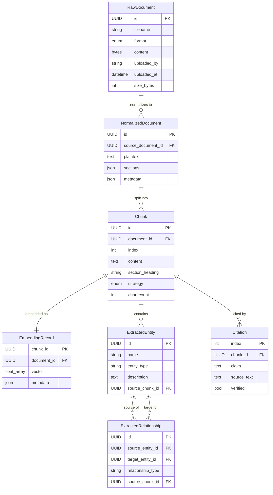
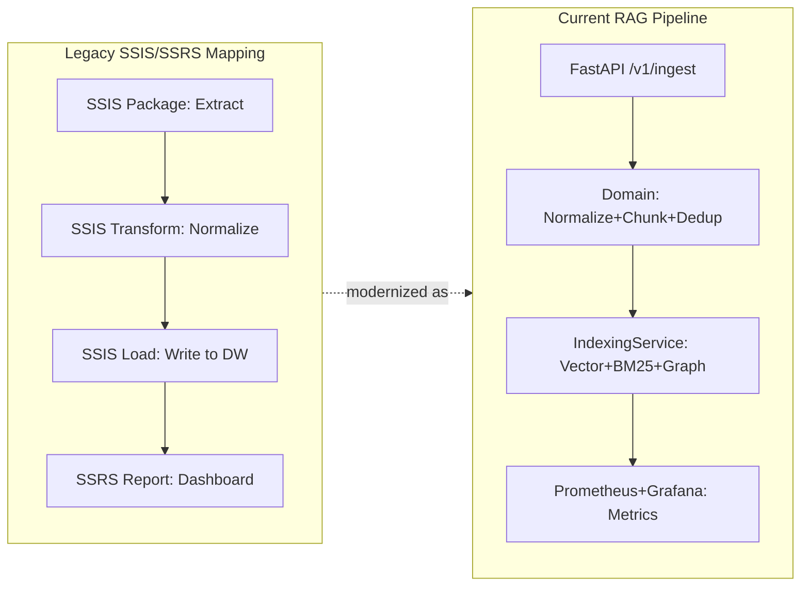

# Interview Preparation Document
## Project: Production RAG Pipeline with Hybrid Search (KYC/Compliance)

**Role Perspective:** Principal Data Architect & Senior AI Data Engineer

---

## 1. Executive Summary & Core Project Architecture

### High-Level Technical Overview

This system is a **production-grade Retrieval-Augmented Generation (RAG) pipeline** designed for a major financial institution's compliance division. It replaces manual policy document searches with an intelligent Q&A system that delivers cited, verifiable answers to compliance questions (KYC, AML/CTF, AUSTRAC regulations) in under 5 seconds.

**Core Scope:**
- Ingest multi-format policy documents (PDF, HTML, Markdown, plaintext)
- Index across three complementary search paradigms: dense vectors, sparse BM25, and knowledge graph
- Answer natural-language queries with bracketed citations traceable to source paragraphs
- Enforce Australian data sovereignty (all processing in ap-southeast-4 Melbourne)
- Provide composite confidence scoring to prevent hallucinated answers

**Architecture Style:** Hexagonal (Ports & Adapters) with domain logic fully isolated from infrastructure.

**Agent Orchestration:** Five specialized AI agents (Strands SDK) with tiered model selection (~70% cost reduction).

### DIAGRAM 1: End-to-End Data & Application Flow

---

## 2. Backend & API Design (Current Implementation)

### API Design Pattern: REST (FastAPI)

**Rationale for REST over GraphQL/gRPC:**
- Compliance stakeholders require simple, auditable HTTP endpoints with standard error codes
- Document ingestion (file upload) maps naturally to multipart REST
- OpenAPI auto-generation enables contract testing (Schemathesis) without manual schema maintenance
- GraphQL complexity is unjustified — query patterns are fixed (ask, ingest, list)
- gRPC protobuf overhead provides no benefit for text-heavy payloads

### Core Endpoints

| Endpoint | Method | Auth | Description |
|----------|--------|------|-------------|
| `/v1/ask` | POST | reader+ | Hybrid search + cited answer with confidence |
| `/v1/ingest` | POST | editor+ | Upload document for processing/indexing |
| `/v1/documents` | GET | reader+ | List ingested documents |
| `/health` | GET | none | Liveness probe |
| `/ready` | GET | none | Readiness probe (checks backing stores) |
| `/metrics` | GET | none | Prometheus scrape endpoint |

### Security Architecture

- **Authentication:** OAuth2/OIDC JWT validation with three roles (`reader`, `editor`, `admin`)
- **Prompt Injection Defense:** Regex detection of 4 attack categories at API boundary
- **Rate Limiting:** Per-user Redis-backed limits, role-tiered, 429 + Retry-After header
- **Correlation IDs:** UUID per request, propagated end-to-end, returned in X-Correlation-ID
- **Input Validation:** Pydantic v2 strict mode (query max 2000 chars, top_k 1-50)
- **Path Traversal Prevention:** Filename validation rejects `..` and backslash characters

### Connection Pooling & Caching Strategy

- Redis semantic query cache with TTL-based eviction
- ChromaDB HttpClient persistent connections (connection reuse)
- Neo4j bolt driver session pooling
- FastAPI lifespan initializes all clients once — no per-request instantiation

### DIAGRAM 2: API Design & Component Interaction

```mermaid
flowchart LR
    subgraph CLIENT["Client Layer"]
        CL["Compliance Analyst<br/>(React Frontend)"]
    end

    subgraph MIDDLEWARE["Middleware Stack (ordered)"]
        direction TB
        M1["1. Correlation ID Generator"]
        M2["2. Request Validation (Pydantic)"]
        M3["3. JWT Authentication"]
        M4["4. Rate Limiter (Redis)"]
        M5["5. Global Error Handler"]
        M1 --> M2 --> M3 --> M4 --> M5
    end

    subgraph API["FastAPI Routes"]
        direction TB
        R1["POST /v1/ask"]
        R2["POST /v1/ingest"]
        R3["GET /v1/documents"]
        R4["GET /health | /ready"]
    end

    subgraph DOMAIN["Domain Services"]
        direction TB
        S1["SecurityService<br/>(prompt injection scan)"]
        S2["RetrievalService<br/>(hybrid search + RRF)"]
        S3["GenerationService<br/>(Bedrock LLM)"]
        S4["IngestionService<br/>(pipeline orchestration)"]
        S5["IndexingService<br/>(triple-store writes)"]
    end

    subgraph PORTS["Port Interfaces (Protocols)"]
        direction TB
        P1["VectorStorePort"]
        P2["SparseIndexPort"]
        P3["GraphStorePort"]
        P4["EmbeddingPort"]
        P5["RerankerPort"]
        P6["DocumentStorePort"]
        P7["CachePort"]
    end

    subgraph INFRA["Infrastructure Adapters"]
        direction TB
        I1["ChromaDB Adapter"]
        I2["BM25 Adapter"]
        I3["Neo4j / Neptune Adapter"]
        I4["Bedrock Embedding Adapter"]
        I5["CrossEncoder Reranker"]
        I6["Local / S3 Document Store"]
        I7["Redis Cache Adapter"]
    end

    CL --> MIDDLEWARE
    MIDDLEWARE --> API
    R1 --> S1
    S1 --> S2
    S2 --> S3
    R2 --> S4
    S4 --> S5
    DOMAIN --> PORTS
    PORTS --> INFRA
```

---

## 3. Database Design & Relational Storage (Current Implementation)

### Polyglot Persistence Strategy

Each store is purpose-built for its access pattern:

| Store | Technology | Access Pattern | Data Model |
|-------|-----------|----------------|------------|
| Dense Vectors | ChromaDB (dev) / Qdrant (prod) | ANN cosine similarity | Embedding vectors + metadata |
| Sparse Index | rank_bm25 (in-memory) | BM25 keyword retrieval | Tokenized document terms |
| Knowledge Graph | Neo4j (dev) / Neptune (prod) | Entity traversal (2-hop) | Nodes + edges |
| Document Store | Local FS (dev) / S3 (prod) | Raw document CRUD | Binary blobs + metadata |
| Cache | Redis 7 | Key-value with TTL | Serialized query results |

### Domain Entity Model (Pydantic v2)

**Core Entities:** RawDocument, NormalizedDocument, Chunk, EmbeddingRecord, ExtractedEntity, ExtractedRelationship

**Query/Response:** ScoredChunk, Citation, ConfidenceScore, GenerationResult

### Indexing Strategy

- **Vector Store:** HNSW index, cosine distance, upsert idempotency, 0.95 dedup threshold
- **BM25:** In-memory inverted index, Okapi scoring, document-level deletion
- **Knowledge Graph:** Entity nodes + relationship edges, 2-hop traversal, cascade deletion

### Legacy Enterprise Mapping (SSIS/SSRS Equivalent)

| Current Component | SSIS Equivalent | SSRS Equivalent |
|-------------------|----------------|-----------------|
| Ingestion Pipeline | SSIS ETL Package (sequential tasks) | N/A |
| Document Normalization | SSIS Data Flow Transform | N/A |
| Chunking Strategies | SSIS Conditional Split + Script Task | N/A |
| Retrieval Service | Stored Procs + Full-Text Search | N/A |
| Confidence Reports | N/A | SSRS Paginated Report with KPIs |
| Pipeline Monitoring | SSIS Catalog Reports | SSRS Dashboard Subscription |

### DIAGRAM 3: Entity Relationship & Data Warehousing Flow

---

## 4. Enterprise Scale-Out & Modern Cloud Transformation

### AWS Infrastructure Re-Platforming

| Component | Current (Dev) | Target (Petabyte-Scale) |
|-----------|--------------|------------------------|
| Compute | ECS Fargate (2 tasks) | EKS Graviton3 + Karpenter |
| Vector DB | ChromaDB (single) | OpenSearch Serverless k-NN or Qdrant on EKS |
| Graph DB | Neo4j Community | Amazon Neptune Serverless |
| Embeddings | Bedrock Titan | Bedrock multi-region + SageMaker fallback |
| Cache | Redis single | ElastiCache cluster (6 shards) |
| Documents | Local FS | S3 Intelligent-Tiering |
| Orchestration | In-process async | Step Functions + SQS |
| Observability | structlog + Prometheus | CloudWatch + X-Ray + Managed Grafana |
| Secrets | Env vars | Secrets Manager (auto-rotation) |

### Data Transformation: dbt Replacement for Legacy ETL

**Why dbt over SSIS:**
- Version-controlled SQL transformations (Git-native, PR-reviewable)
- Lineage tracking with automated DAG documentation
- Built-in data quality tests (not_null, unique, accepted_values, relationships)
- Incremental materialization for large metadata tables
- Environment promotion (dev/staging/prod) without redeployment

**dbt Model Layer Design:**

| Layer | Models | Purpose |
|-------|--------|---------|
| Staging | stg_documents, stg_chunks, stg_queries | Raw event log normalization |
| Intermediate | int_document_quality, int_entity_network, int_retrieval_perf | Business logic joins |
| Marts | fct_query_performance, fct_ingestion_pipeline, dim_documents, dim_entities | Analytics-ready |

### Graph Analytics Layer: Amazon Neptune

**Why Graph for Compliance:**
- PEP → Sanctions → EDD linkage traversal
- Beneficial ownership chains (multi-hop corporate structures)
- Cross-document entity resolution (same person across 40+ policy docs)

**Neptune Design:**
- Property graph (TinkerPop/Gremlin), auto-scaling 1-128 NCUs
- Entity nodes: Person, Organization, Policy, Regulation, Concept
- Edges: MENTIONS, RELATES_TO, DEPENDS_ON, SUPERSEDES, OWNED_BY
- 2-hop traversal for query-time context enrichment
- Bulk load via Neptune Loader (S3 CSV)

### Vector Infrastructure: Production-Grade Embedding Storage

**Scale-Out Options:**

| Solution | Best For | Trade-off |
|----------|----------|-----------|
| pgvector (Aurora) | Small corpus (<5M docs), SQL integration | ANN degrades >10M vectors |
| Pinecone | Zero-ops SaaS, multi-tenant | Vendor lock-in, cost at scale |
| Qdrant | High-throughput, open-source | Self-hosted ops |
| OpenSearch k-NN | AWS-native, hybrid text+vector | Higher latency vs specialized |
| Milvus | Billions of vectors, GPU accel | etcd/MinIO operational complexity |

**Recommended:** OpenSearch Serverless (k-NN) — consolidates vector+sparse in one service, native AWS IAM/VPC integration, serverless auto-scaling.

**RAG-Specific Vector Patterns:**
- 768-dim embeddings (Bedrock Titan v2), cosine similarity
- Namespace isolation per document collection (multi-tenant)
- Metadata filtering: document_id, section_heading, strategy
- Scalar quantization for 4x memory reduction at <2% recall loss
- HNSW tuning: ef_construction=256, M=16

### Python Backend Ecosystem

| Library | Role | Rationale |
|---------|------|-----------|
| FastAPI | Async REST API | Fastest ASGI, Pydantic-native |
| Pydantic v2 | Schema enforcement | Rust-speed, strict mode |
| Strands SDK | Agent orchestration | AWS-native, typed tools |
| structlog | Structured logging | Context binding, processors |
| tenacity | Retry/backoff | Decoratable, jitter support |
| sentence-transformers | Cross-encoder rerank | Local, no API cost |
| rank_bm25 | Sparse retrieval | Zero deps, fast |
| PySpark | (Scale-out) Distributed embedding | Parallel chunk processing |

**Why custom RAG over LangChain/LlamaIndex:**
- Hexagonal architecture requires clean port/adapter boundaries
- Custom RRF with configurable per-query-type weights
- Citation verification as first-class pipeline stage
- Strands provides cleaner tool-use with typed Python functions

---

## 5. Advanced Interview Scenarios & Edge Cases (Q&A Appendix)

### Q1: Vector store goes down in production — what happens?

**Answer:** Graceful degradation is built-in. Each search method runs in try/except within asyncio.gather. If dense search fails:
1. Circuit breaker opens after 5 failures (30s recovery)
2. `degraded_modes` list records "dense_unavailable"
3. RRF fusion proceeds with sparse + graph only (re-weighted)
4. Response includes degradation metadata
5. Prometheus alert fires

System still answers — reduced recall, but available. Critical for compliance where uptime trumps perfection.

### Q2: Schema evolution when document formats change?

**Answer:** Multiple defense layers:
- **Normalizer registry:** Strategy pattern dispatches to format-specific handlers. New format = register normalizer, no existing code touched.
- **Pydantic v2 strict:** Catches malformed data at ingestion boundary — fails fast with typed errors.
- **Idempotent re-indexing:** `reindex()` removes all old entries across 3 stores, re-processes fresh.
- **Event-driven:** DocumentIngestedEvent decouples downstream processing.

### Q3: Confidence score false positives — high confidence but wrong answer?

**Answer:** Hardest RAG failure mode. Mitigations:
1. **Citation verification (LLM-as-judge):** Every claim validated against source chunk.
2. **Composite formula** separates retrieval quality from generation quality.
3. **Fallback threshold (0.4):** Below this → explicit "I don't know" with evidence found.
4. **Golden dataset evaluation:** Regular benchmarking catches systematic drift.
5. **Human-in-the-loop:** System provides evidence — humans make final regulatory call.

### Q4: Embedding model drift (Titan v1 → v2)?

**Answer:**
- **Detect:** Monitor retrieval confidence time-series (Prometheus). Sudden drops = drift.
- **Mitigate:** Full re-embedding via `reindex()` — remove old vectors, re-embed, re-store.
- **Prevent:** Pin model version in config. Upgrades = scheduled re-indexing.
- **A/B test:** Dual collections, compare on golden dataset before cutover.

### Q5: Partial pipeline failure — vectors stored but BM25 write fails?

**Answer:** Compensating transaction pattern in IndexingService:
1. Sparse index fails AFTER vector store → rollback vectors (delete_by_document)
2. IndexingError carries `partial=True` flag
3. Correlation ID traces exactly what succeeded vs failed
4. Re-ingestion is idempotent (upsert) — safe to retry entire document

NOT a 2PC distributed transaction (impossible across incompatible stores).

### Q6: How do you prevent prompt injection in a compliance RAG system?

**Answer:** Defense-in-depth:
1. **API boundary:** SecurityService regex scans detect 4 attack categories before any LLM call
2. **Document scanning:** Indirect injection patterns in ingested content (prevents poisoned docs)
3. **System prompt isolation:** Strands agent system prompts are not user-modifiable
4. **Output validation:** Generated answers are citation-checked — hallucinated content fails verification
5. **Role-based access:** Readers can't ingest (prevents adversarial document injection)

### Q7: Why three search methods instead of just dense vectors?

**Answer:** No single retrieval method handles all query types in compliance:
- **Dense (semantic):** "What are the requirements for high-risk customers?" (paraphrasing)
- **Sparse (BM25):** "Section 4.2.1 AUSTRAC reporting threshold" (exact terms)
- **Graph:** "Which policies relate to PEP screening AND beneficial ownership?" (relationships)

RRF fusion ensures the system degrades gracefully — if one method returns nothing, the others compensate. Configurable weights let you tune per query category.

### Q8: How would you scale to 100M documents?

**Answer:**
1. **Embedding pipeline:** PySpark distributed embedding generation (embarrassingly parallel)
2. **Vector store:** Milvus or OpenSearch with sharding + scalar quantization (4x memory reduction)
3. **Ingestion:** SQS queue → Lambda fan-out → Step Functions orchestration (no single-process bottleneck)
4. **Graph:** Neptune with read replicas + bulk loader (S3 CSV at 1M edges/minute)
5. **Chunking:** Increase chunk size (1000 chars) to reduce vector count while maintaining recall
6. **Caching:** Aggressive semantic cache (Redis) — compliance questions are repetitive

### Q9: What's your testing strategy for non-deterministic LLM outputs?

**Answer:**
- **Property-based tests (Hypothesis):** Test invariants, not specific outputs. "For ALL valid inputs, output must contain at least one citation" — not "output must equal this exact string."
- **Structured output validation:** Pydantic models enforce schema regardless of LLM content.
- **Golden dataset:** Fixed Q&A pairs with known-good answers. Score similarity, not equality.
- **Citation verification:** Deterministic check — does the cited text actually support the claim?
- **Confidence bounds:** Verify composite score ∈ [0, 1] and component weights sum to 1.0.

### Q10: Architecture pivot — what if Bedrock is unavailable in the target region?

**Answer:** The hexagonal architecture makes this a one-adapter swap:
1. `EmbeddingPort` protocol doesn't reference Bedrock — any implementation works
2. Create `OpenAIEmbeddingAdapter` or `SageMakerEmbeddingAdapter` implementing same protocol
3. Wire in `create_app()` lifespan — zero domain code changes
4. Run integration tests against new adapter
5. Deploy with feature flag for gradual rollout

This is exactly why ports/adapters architecture was chosen — vendor independence at the infrastructure boundary.

---

*Document generated for elite-level technical interview preparation. All diagrams render in any Mermaid.js-compatible viewer (GitHub, GitLab, Notion, VS Code preview).*
