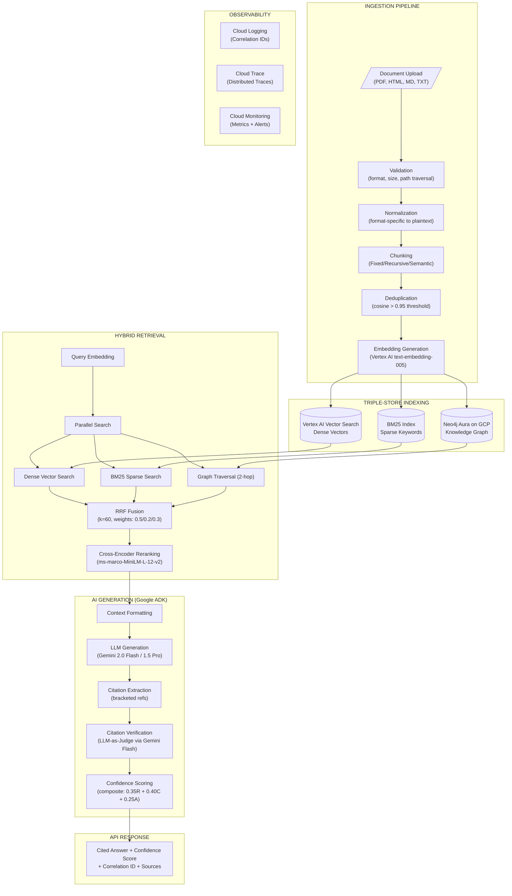
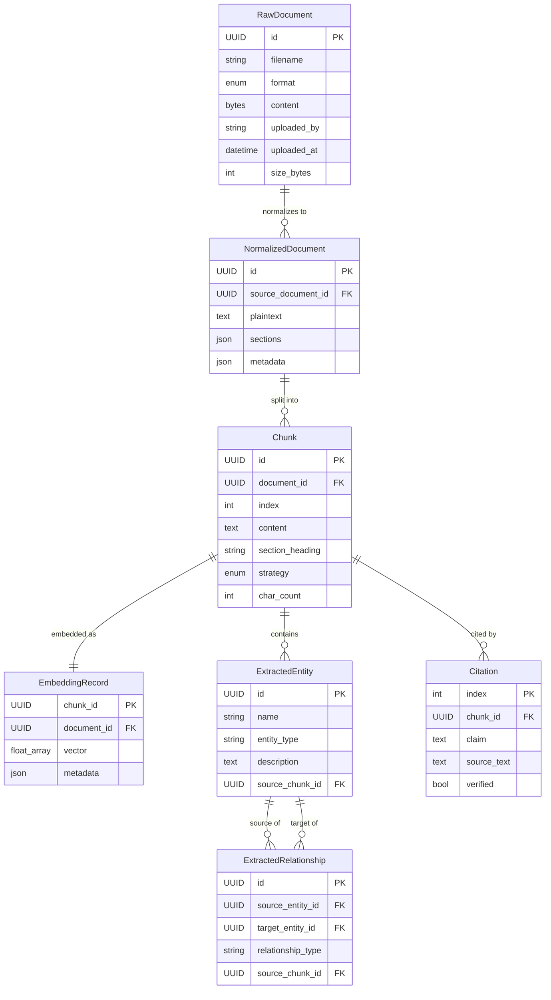

# Interview Preparation Document — GCP Edition
## Project: Production RAG Pipeline with Hybrid Search (KYC/Compliance)
## Target Platform: Google Cloud Platform — Vertex AI + Google ADK + Cloud Run

**Role Perspective:** Principal Data Architect & Senior AI Data Engineer

---

## 1. Executive Summary & Core Project Architecture

### High-Level Technical Overview

This system is a **production-grade Retrieval-Augmented Generation (RAG) pipeline** designed for a major financial institution's compliance division. It replaces manual policy document searches with an intelligent Q&A system that delivers cited, verifiable answers to compliance questions (KYC, AML/CTF, AUSTRAC regulations) in under 5 seconds.

**Core Scope:**
- Ingest multi-format policy documents (PDF, HTML, Markdown, plaintext)
- Index across three complementary search paradigms: dense vectors, sparse BM25, and knowledge graph
- Answer natural-language queries with bracketed citations traceable to source paragraphs
- Enforce Australian data sovereignty (all processing in `australia-southeast1` Sydney / `australia-southeast2` Melbourne)
- Provide composite confidence scoring to prevent hallucinated answers

**Architecture Style:** Hexagonal (Ports & Adapters) with domain logic fully isolated from infrastructure.

**Agent Orchestration:** Five specialized AI agents using **Google ADK** (Agent Development Kit) with `SequentialAgent` orchestration and **Vertex AI Gemini** tiered model selection (~80% cost reduction vs. premium models).

### DIAGRAM 1: End-to-End Data & Application Flow (GCP Native)



---

## 2. Backend & API Design (GCP Implementation)

### API Design Pattern: REST (FastAPI on Cloud Run)

**Rationale for REST over GraphQL/gRPC:**
- Compliance stakeholders require simple, auditable HTTP endpoints with standard error codes
- Document ingestion (file upload) maps naturally to multipart REST
- OpenAPI auto-generation enables contract testing (Schemathesis) without manual schema maintenance
- Cloud Run natively serves HTTP requests with built-in load balancing and TLS termination

### Core Endpoints (Cloud Run Services)

| Endpoint | Method | Auth | Service | Description |
|----------|--------|------|---------|-------------|
| `/v1/agents/ask` | POST | reader+ | query-service | Full agent pipeline with confidence |
| `/v1/ask` | POST | reader+ | query-service | Direct retrieval (backward compat) |
| `/v1/ingest` | POST | editor+ | ingestion-service | Upload document for processing/indexing |
| `/v1/documents` | GET | reader+ | ingestion-service | List ingested documents |
| `/health` | GET | none | all services | Aggregated liveness probe |
| `/health/ready` | GET | none | all services | Readiness probe (checks backing stores) |
| `/metrics` | GET | none | all services | Prometheus-compatible scrape endpoint |

### Security Architecture (GCP Native)

- **Authentication:** Google Identity Platform / Firebase Auth with JWT validation (supports SAML federation for government SSO)
- **Service Identity:** Workload Identity binds Cloud Run service accounts to IAM roles — zero static credentials
- **Prompt Injection Defense:** Regex detection of 4 attack categories at API boundary + Vertex AI Safety Settings
- **Rate Limiting:** Cloud Armor rate limiting policies (persistent, per-client) + application-level token bucket backed by Memorystore
- **Correlation IDs:** UUID per request, propagated end-to-end via `X-Correlation-ID` header
- **Input Validation:** Pydantic v2 strict mode (query max 2000 chars, top_k 1-50)
- **API Security:** Cloud Armor WAF rules (OWASP Top 10, bot detection, geo-fencing to Australia)

### Connection Pooling & Caching Strategy

- Cloud Memorystore (Redis) for semantic query cache with TTL-based eviction
- Vertex AI Vector Search persistent gRPC connections
- Neo4j Aura bolt driver session pooling
- FastAPI lifespan initializes all clients once — no per-request instantiation
- Cloud Run min-instances keeps services warm for sub-second response initiation

### DIAGRAM 2: API Design & Component Interaction (GCP)

```mermaid
flowchart LR
    subgraph CLIENT["Client Layer"]
        CL["Compliance Analyst<br/>(React Frontend on Firebase Hosting)"]
    end

    subgraph EDGE["Edge and Security"]
        direction TB
        E1["Cloud CDN + Cloud Armor"]
        E2["Google Identity Platform (JWT)"]
        E1 --> E2
    end

    subgraph GATEWAY["API Gateway (Cloud Run)"]
        direction TB
        M1["1. Correlation ID Generator"]
        M2["2. Request Validation (Pydantic)"]
        M3["3. JWT Authentication"]
        M4["4. Rate Limiter (Memorystore Redis)"]
        M5["5. Global Error Handler"]
        M1 --> M2 --> M3 --> M4 --> M5
    end

    subgraph SERVICES["Cloud Run Services"]
        direction TB
        R1["Query Service"]
        R2["Ingestion Service"]
        R3["Embedding Service"]
        R4["Graph Service"]
    end

    subgraph AGENTS["Google ADK Agents"]
        direction TB
        A1["Retrieval Agent (Gemini Flash)"]
        A2["Generation Agent (Gemini 1.5 Pro)"]
        A3["Citation Agent (Gemini Flash)"]
        A4["Evaluation Agent (Gemini 1.5 Pro)"]
    end

    subgraph PORTS["Port Interfaces (Protocols)"]
        direction TB
        P1["VectorStorePort"]
        P2["SparseIndexPort"]
        P3["GraphStorePort"]
        P4["EmbeddingPort"]
        P5["RerankerPort"]
        P6["DocumentStorePort"]
        P7["CachePort"]
    end

    subgraph INFRA["GCP Infrastructure Adapters"]
        direction TB
        I1["Vertex AI Vector Search"]
        I2["BM25 (in-memory)"]
        I3["Neo4j Aura (GCP Marketplace)"]
        I4["Vertex AI Embeddings"]
        I5["CrossEncoder Reranker (local)"]
        I6["Cloud Storage (Documents)"]
        I7["Cloud Memorystore (Redis)"]
    end

    CL --> EDGE
    EDGE --> GATEWAY
    GATEWAY --> SERVICES
    R1 --> AGENTS
    AGENTS --> PORTS
    PORTS --> INFRA
```



---

## 3. Database Design & Storage (GCP Implementation)

### Polyglot Persistence Strategy

| Store | Technology | Access Pattern | Data Model |
|-------|-----------|----------------|------------|
| Dense Vectors | Vertex AI Vector Search (managed) | ANN cosine similarity | 768-dim embedding vectors + metadata |
| Sparse Index | rank_bm25 (in-memory) | BM25 keyword retrieval | Tokenized document terms |
| Knowledge Graph | Neo4j Aura (GCP Marketplace) | Entity traversal (2-hop) | Property graph nodes + edges |
| Document Store | Cloud Storage (GCS) | Raw document CRUD | Binary blobs + metadata |
| Cache | Cloud Memorystore (Redis 7) | Key-value with TTL | Serialized query results |
| Audit/Metadata | Cloud SQL (PostgreSQL 15) | Relational queries | Ingestion records, user sessions, audit logs |

### Domain Entity Model (Pydantic v2)

Identical domain models — infrastructure-agnostic due to hexagonal architecture:

**Core Entities:** RawDocument, NormalizedDocument, Chunk, EmbeddingRecord, ExtractedEntity, ExtractedRelationship

**Query/Response:** ScoredChunk, Citation, ConfidenceScore, GenerationResult

### DIAGRAM 3: Entity Relationship Model



---

## 4. GCP Cloud Infrastructure & Scale-Out

### GCP Stack Comparison

| Component | AWS (Original) | GCP (Target) | Migration Rationale |
|-----------|---------------|--------------|---------------------|
| Compute | ECS Fargate | **Cloud Run** | Scale-to-zero, per-request billing, built-in LB |
| LLM Inference | Bedrock (Nova/Claude) | **Vertex AI** (Gemini 2.0 Flash / 1.5 Pro) | Unified AI platform, lower token cost |
| Embeddings | Bedrock Titan V2 (1024d) | **Vertex AI text-embedding-005** (768d) | Integrated with Vector Search |
| Agent Framework | Strands Agents SDK | **Google ADK** (SequentialAgent, LoopAgent) | Native Vertex AI, A2A HTTP, evaluation |
| Vector Store | ChromaDB / OpenSearch | **Vertex AI Vector Search** | Managed ANN, auto-scaling, streaming |
| Graph DB | Neo4j / Neptune | **Neo4j Aura** (GCP Marketplace) | Protocol-compatible, managed |
| Cache | Redis / ElastiCache | **Cloud Memorystore (Redis)** | Same protocol, managed |
| Documents | Local FS / S3 | **Cloud Storage (GCS)** | Object storage with lifecycle |
| Secrets | Env vars / Secrets Manager | **GCP Secret Manager** | IAM access, versioning |
| Auth | API Keys / Cognito | **Google Identity Platform** | SAML, MFA, JWT |
| CDN | CloudFront | **Cloud CDN** | Edge caching |
| WAF | AWS WAF | **Cloud Armor** | DDoS, rate limiting, OWASP |
| Logging | CloudWatch | **Cloud Logging** | Auto-collected JSON |
| Tracing | X-Ray | **Cloud Trace** (OTLP native) | OpenTelemetry compatible |
| Metrics | CloudWatch Metrics | **Cloud Monitoring** | SLO monitoring |
| IaC | Terraform (AWS) | **Terraform** (Google) | Same tool |
| CI/CD | GitLab CI | **GitLab CI** (unchanged) | Same pipeline |
| Registry | ECR | **Artifact Registry** | Multi-format |

### Google ADK Agent Architecture

```python
from google.adk import Agent, SequentialAgent
from google.adk.models import Gemini

# Tiered model selection (cost optimization ~80% savings)
MODELS = {
    "flash": Gemini(model="gemini-2.0-flash", temperature=0.1),
    "pro": Gemini(model="gemini-1.5-pro", temperature=0.1),
}

# Specialist agents with typed tools
retrieval_agent = Agent(
    name="retrieval",
    model=MODELS["flash"],
    tools=[dense_search, sparse_search, graph_search, rrf_fuse, rerank],
    instruction="Execute hybrid search with RRF fusion across all methods..."
)

generation_agent = Agent(
    name="generation",
    model=MODELS["pro"],
    tools=[format_context, generate_answer, extract_citations, compute_confidence],
    instruction="Generate grounded answer with [N] citations using ONLY provided context..."
)

citation_agent = Agent(
    name="citation_verification",
    model=MODELS["flash"],
    tools=[verify_claim_pair],
    instruction="Verify each citation-claim pair. Classify: verified/unsupported/partial..."
)

evaluation_agent = Agent(
    name="evaluation",
    model=MODELS["pro"],
    tools=[score_retrieval, score_completeness],
    instruction="Compute confidence across three dimensions..."
)

# Sequential orchestration
rag_pipeline = SequentialAgent(
    name="rag_pipeline",
    sub_agents=[retrieval_agent, generation_agent, citation_agent, evaluation_agent],
)
```

### Vertex AI Embedding Adapter

```python
from google.cloud import aiplatform
from src.ports.embedding import EmbeddingPort

class VertexEmbeddingAdapter:
    """Vertex AI Embeddings implementing EmbeddingPort."""

    def __init__(self, project: str, location: str = "australia-southeast1"):
        self._project = project
        self._location = location
        self._model = aiplatform.TextEmbeddingModel.from_pretrained("text-embedding-005")

    async def embed(self, texts: list[str]) -> list[list[float]]:
        embeddings = self._model.get_embeddings(texts)
        return [e.values for e in embeddings]

    async def embed_single(self, text: str) -> list[float]:
        result = self._model.get_embeddings([text])
        return result[0].values
```

### Python Backend Ecosystem (GCP-Native)

| Library | Role | Rationale |
|---------|------|-----------|
| FastAPI | Async REST API | Cloud Run optimized, native async |
| Pydantic v2 | Schema enforcement | Rust-speed validation |
| Google ADK | Agent orchestration | Native Vertex AI, typed tools, A2A |
| google-cloud-aiplatform | Vertex AI SDK | Embeddings, LLM, Vector Search |
| structlog | Structured logging | Cloud Logging JSON auto-parse |
| tenacity | Retry/backoff | Circuit breaker patterns |
| sentence-transformers | Cross-encoder rerank | Local inference, zero API cost |
| rank_bm25 | Sparse retrieval | In-memory, cloud-agnostic |
| opentelemetry-exporter-gcp-trace | Tracing | Cloud Trace integration |
| google-cloud-secret-manager | Secrets | Runtime credential access |

---

## 5. Advanced Interview Scenarios & Edge Cases (Q&A)

### Q1: Vector store goes down in production — what happens?

**Answer:** Graceful degradation is built-in. Each search method runs in try/except within asyncio.gather. If Vertex AI Vector Search is unavailable:
1. Circuit breaker opens after 5 failures (30s recovery)
2. `degraded_modes` list records "dense_unavailable"
3. RRF fusion proceeds with sparse + graph only (re-weighted to sum 1.0)
4. Response includes degradation metadata for observability
5. Cloud Monitoring alerting policy fires → PagerDuty notification

System still answers — reduced recall, but available. Cloud Run health checks route traffic away from unhealthy instances automatically.

### Q2: How does Google ADK handle agent failures vs. Strands SDK?

**Answer:** Key architectural differences:
- **State management:** ADK manages session state natively between agents in `SequentialAgent` — eliminates manual state serialization
- **Tool errors:** ADK wraps tool failures in structured error responses; downstream agents can reason about failures
- **A2A HTTP:** Agents communicate cross-service via HTTP — enabling independent scaling per agent
- **Retry:** ADK `LoopAgent` retries sub-agents with modified parameters on failure (configurable max iterations)
- **Observability:** Every tool call and agent step is automatically traced in Cloud Trace with full Vertex AI lineage
- **Evaluation:** ADK includes built-in evaluation hooks — no separate Evaluation Agent needed for standard metrics

### Q3: Confidence score false positives — high confidence but wrong answer?

**Answer:** Defense-in-depth with GCP-specific tooling:
1. **Citation verification (Gemini Flash as judge):** Every claim validated against source chunk
2. **Vertex AI Safety Settings:** Block unsafe or ungrounded content at model level (configurable thresholds)
3. **Composite formula** separates retrieval quality from generation quality (0.35R + 0.40C + 0.25A)
4. **Fallback threshold (0.4):** Below this → explicit "I don't know" with partial evidence
5. **Vertex AI Evaluation API:** Built-in RAG metrics (groundedness, relevance, coherence) for regression testing
6. **Human-in-the-loop:** Cloud SQL stores flagged responses; analysts review via internal tool

### Q4: Embedding model drift when Google updates text-embedding-005?

**Answer:**
- **Detect:** Monitor retrieval confidence via Cloud Monitoring custom metric time-series
- **Mitigate:** Full re-embedding via idempotent `reindex()` pipeline (Cloud Run Jobs for batch)
- **Prevent:** Pin model version in Vertex AI endpoint configuration (`text-embedding-005@001`)
- **A/B test:** Deploy two Vector Search indexes, compare on golden dataset via Vertex AI Evaluation
- **GCP advantage:** Vertex AI Model Registry tracks versions with lineage; Vertex AI Experiments for comparison

### Q5: How do you prevent prompt injection in a compliance RAG on GCP?

**Answer:** Defense-in-depth:
1. **Cloud Armor:** WAF rules block known injection patterns at edge (before Cloud Run)
2. **API boundary:** SecurityService regex scans detect 4 attack categories before any LLM call
3. **Vertex AI Safety Settings:** Model-level content filtering (BLOCK_MEDIUM_AND_ABOVE for harmful categories)
4. **System prompt isolation:** ADK agent instructions are code-declared, not user-modifiable
5. **Output validation:** Citation verification rejects hallucinated or ungrounded claims
6. **Role-based access:** Only editors can ingest documents (prevents adversarial document injection)
7. **Audit trail:** Cloud SQL + Cloud Logging captures every query for compliance review

### Q6: Why three search methods instead of just Vertex AI Vector Search?

**Answer:** No single retrieval method handles all compliance query types:
- **Dense (Vertex AI Vector Search):** "What are the requirements for high-risk customers?" (semantic similarity, paraphrasing)
- **Sparse (BM25):** "Section 4.2.1 AUSTRAC reporting threshold" (exact regulatory terms, policy codes)
- **Graph (Neo4j Aura):** "Which policies relate to PEP screening AND beneficial ownership?" (entity relationships across documents)

RRF fusion ensures graceful degradation — if one method is unavailable, others compensate with re-weighted scores. Configurable per-query-type weights optimize precision for each category.

### Q7: How would you scale to 100M documents on GCP?

**Answer:**
1. **Embedding pipeline:** Cloud Run Jobs with high concurrency (embarrassingly parallel batch processing)
2. **Vector store:** Vertex AI Vector Search natively scales to billions of vectors (managed sharding)
3. **Ingestion:** Pub/Sub → Cloud Run fan-out processing (horizontal scale, no bottleneck)
4. **Graph:** Neo4j Aura Enterprise with read replicas; or AlloyDB for hybrid relational+graph
5. **Chunking:** Vertex AI Document AI for intelligent segmentation of complex PDFs
6. **Caching:** Memorystore Redis Cluster (sharded, 300GB capacity)
7. **Cost:** Vertex AI Vector Search supports quantization (4x memory reduction, <2% recall loss)

### Q8: Architecture pivot — what if Vertex AI is unavailable in the target region?

**Answer:** The hexagonal architecture makes this a one-adapter swap:
1. `EmbeddingPort` protocol doesn't reference Vertex AI — any implementation works
2. Create `OpenAIEmbeddingAdapter` or `CohereEmbeddingAdapter` implementing same Protocol
3. Wire in `create_app()` lifespan — zero domain code changes
4. Run integration tests against new adapter
5. Cloud Run traffic splitting enables gradual rollout (canary deployment to 10% traffic)

This is exactly why ports/adapters architecture was chosen — vendor independence at the infrastructure boundary.

### Q9: What's your testing strategy for non-deterministic LLM outputs on GCP?

**Answer:**
- **Property-based tests (Hypothesis):** Test invariants, not specific outputs. "For ALL valid inputs, output must contain at least one citation" — tests formal correctness properties
- **Pydantic schema validation:** Structured output enforcement regardless of LLM content
- **Vertex AI Evaluation:** Built-in metrics (groundedness, relevance, coherence, safety) against golden dataset
- **Citation verification:** Deterministic check — does the cited text actually support the claim?
- **Confidence bounds:** Verify composite score is in [0, 1] and component weights sum to 1.0
- **Cloud Monitoring SLOs:** Track evaluation metrics as SLI/SLO with automatic alerting on >5% regression

### Q10: How does Cloud Run compare to ECS Fargate for this workload?

**Answer:**

| Dimension | ECS Fargate | Cloud Run | Winner for RAG |
|-----------|-------------|-----------|----------------|
| Scaling | CPU autoscaling, min 1 task | Concurrency-based, scale-to-zero | Cloud Run (cost) |
| Cold start | Always warm (min tasks running) | ~1-2s (mitigated with min-instances) | Fargate (latency) |
| Pricing | Per-vCPU-second (always on) | Per-request (100ms granularity) | Cloud Run (bursty workloads) |
| Load balancing | ALB required (separate config) | Built-in (zero config) | Cloud Run (simplicity) |
| Deployment | Task def + service update + ALB | `gcloud run deploy` (one command) | Cloud Run (DX) |
| Long requests | No timeout | 60min max (configurable) | Tie (30s queries fine) |
| TLS | ACM + ALB config | Automatic (zero config) | Cloud Run |

For this RAG workload (bursty compliance queries, 5-30s per request), Cloud Run with min-instances=2 delivers equivalent latency to Fargate at 30-50% lower cost due to per-request billing and scale-to-zero during off-hours.

---

*Document generated for elite-level technical interview preparation targeting GCP-native architectures. All architecture references anchored on Google ADK, Vertex AI (Gemini 2.0 Flash / 1.5 Pro), Cloud Run microservices, and sub-10s latency for compliance RAG workloads.*
